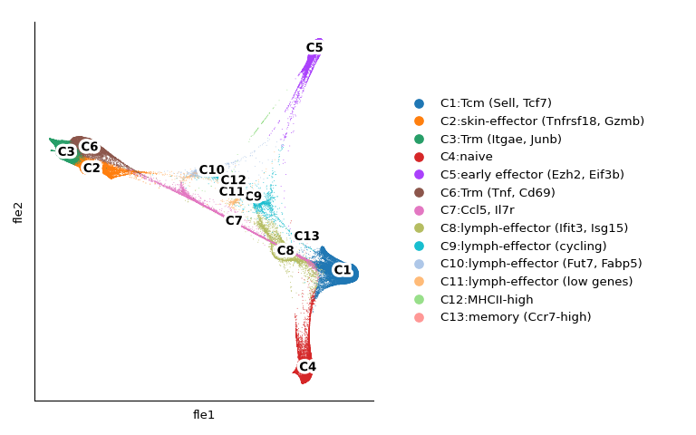
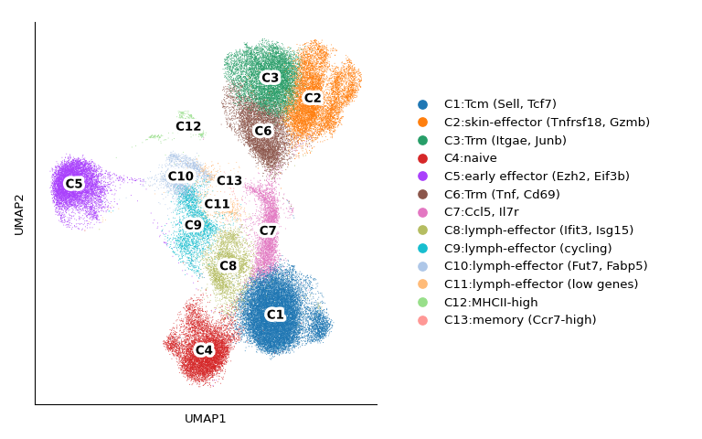
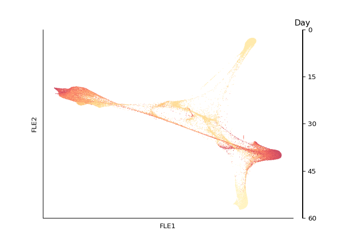
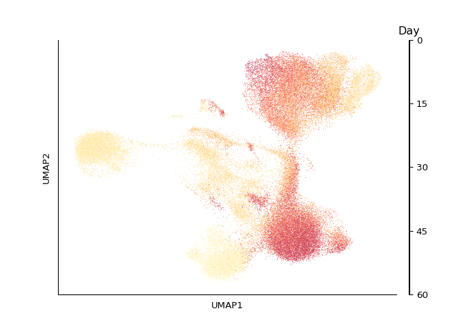
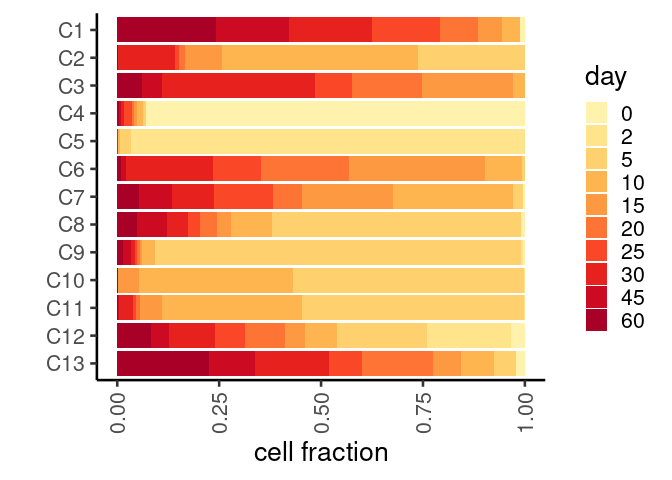
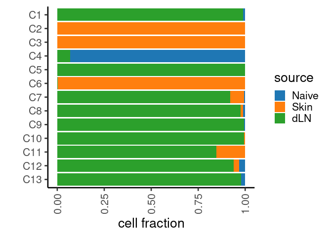
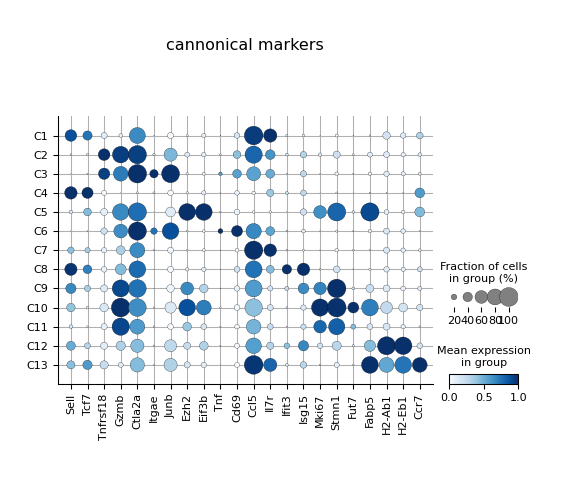

Figure 1
================

``` r
library(reticulate)
library(gtools)
library(tidyverse)
library(ggplot2)

use_python("/projects/home/nealpsmith/.conda/envs/old_peg_github/bin/python")
```

``` python
import getpass
import pegasus as pg
```

    ## WARNING:param.Parameterized: Use method 'warning' via param namespace 
    ## WARNING:param.main: pandas could not register all extension types imports failed with the following error: cannot import name 'ABCIndexClass' from 'pandas.core.dtypes.generic' (/projects/home/nealpsmith/.conda/envs/old_peg_github/lib/python3.7/site-packages/pandas/core/dtypes/generic.py)

``` python
import scanpy as sc
import os
import matplotlib.pyplot as plt
import pandas as pd
import numpy as np
import anndata
import math
import seaborn as sns
import matplotlib.colors as clr
from pylab import cm
import matplotlib as mpl
from matplotlib.lines import Line2D
# import harmonypy as hm
# import neals_python_functions as nealsucks
from mpl_toolkits.axes_grid1 import make_axes_locatable
# import rpy2.robjects as ro
# from rpy2.robjects import pandas2ri
# from rpy2.robjects.conversion import localconverter
from scipy.sparse import csr_matrix
from collections import Counter
mpl.rcParams['axes.spines.right'] = False
mpl.rcParams['axes.spines.top'] = False
# mpl.rcParams['pdf.fonttype'] = 42

# Set a colormap
gene_colormap = clr.LinearSegmentedColormap.from_list('gene_cmap', ["#e0e0e1", '#4576b8', '#02024a'], N=200)

cmap = cm.get_cmap('YlOrRd', 110)    # PiYG
hex_list = []
for i in range(cmap.N):
    rgba = cmap(i)
    # rgb2hex accepts rgb or rgba
    hex_list.append(mpl.colors.rgb2hex(rgba))

colors = [c for n, c in enumerate(hex_list) if n%10 == 0]
colors = colors [1:11] # First one is too dim
days = ["0", "2", "5", "10", "15", "20", "25", "30", "45", "60"]

day_col_dict = dict(zip(days, colors))
day_cmap = clr.LinearSegmentedColormap.from_list('day_cmap', colors, N=len(colors))

# Set a switcher up so the script will run on any computer
def file_path(user = getpass.getuser()):
    switcher = {
            "nealp": "C:/Users/nealp/Documents/Dropbox (Partners HealthCare)/Chloe&Mazen/Collaborator_projects/Kupper_TRM/neal_analysis/all_data_analysis",
            "neal": "/home/neal/Documents/Dropbox (Partners HealthCare)/Chloe&Mazen/Collaborator_projects/Kupper_TRM/neal_analysis/all_data_analysis",
            "nealpsmith": "/projects/home/nealpsmith/projects/kupper/all_data_analysis"

    }
    if switcher.get(user):
        return(switcher.get(user))
    else :
        print("Add your local filepath to the switcher! run getpass.getuser() to get your ID")

filtered2_no_skin2 = pg.read_input(
    os.path.join(file_path(), "data", "integrated", "filtered2_no_skin2_harmonized_with_subclust.h5ad"))
```

    ## 2023-08-09 16:28:58,786 - pegasus - INFO - Time spent on 'read_input' = 4.99s.

``` python

genes =  ["Cd3d", "Cd8a", "Trbc2"]

ncols = int(round(np.sqrt(len(genes))))
fig, ax = plt.subplots(ncols = ncols, nrows = ncols, figsize = (7, 7))
ax = ax.ravel()

for num, gene in enumerate(genes) :
    plot_df = pd.DataFrame(filtered2_no_skin2[:,gene].X.toarray(), columns = [gene], index = filtered2_no_skin2.obs_names)
    plot_df["x"] = filtered2_no_skin2.obsm["X_umap"][:, 0]
    plot_df["y"] = filtered2_no_skin2.obsm["X_umap"][:, 1]
    hb = ax[num].hexbin(plot_df["x"], plot_df["y"], C=plot_df[gene], cmap=gene_colormap, gridsize=250, edgecolors = "none")
    _ = ax[num].get_xaxis().set_ticks([])
    _ = ax[num].get_yaxis().set_ticks([])
    _ = ax[num].spines['top'].set_visible(False)
    _ = ax[num].spines['right'].set_visible(False)
    _ = ax[num].set_title(gene, size = 25)
    cb = fig.colorbar(hb, ax=ax[num], shrink=.75, aspect=10)
    _ = cb.ax.set_title("logCPM")
for noplot in range(num + 1, len(ax)) :
    ax[noplot].axis("off")
_ = fig.text(0.5, 0.03, 'UMAP1', va='center', size = 15)
_ = fig.text(0.03, 0.5, 'UMAP2', va='center', rotation='vertical', size = 15)
# plt.subplots_adjust(left = 0.1, bottom = 0.1)
figure = plt.gcf()
# figure.tight_layout()
figure.set_size_inches(5, 5)
figure
```



``` python
annot_info = pd.read_csv("/projects/home/nealpsmith/projects/kupper/all_data_analysis/data/integrated/supplemental_tables/cluster_annotations.csv")
annot_info["cluster_number"] = [str(n) for n in annot_info["cluster_number"]]
annot_dict = dict(zip(annot_info["cluster_number"], annot_info["annotation"]))

filtered2_no_skin2.obs["annotation"] = [annot_dict[cl] for cl in filtered2_no_skin2.obs["new_clusters"]]
# Append a "C" to the clusters as well
filtered2_no_skin2.obs["new_clusters"] = [f"C{cl}" for cl in filtered2_no_skin2.obs["new_clusters"]]

# Cleaner cluster one
sorted_clusts = sorted(set(filtered2_no_skin2.obs["annotation"]), key = lambda s: int(s.split(":")[0].replace("C", "")))
col_dict = dict(zip(sorted_clusts,filtered2_no_skin2.uns["new_clusters_colors"]))

legend_elements = [Line2D([0], [0], marker='o', color=col_dict[cl], label=cl,
                          markerfacecolor=col_dict[cl], markersize=7, lw=0) for cl in
                   sorted_clusts]

fig, ax = plt.subplots(1)
plot = sc.pl.umap(filtered2_no_skin2, color="new_clusters",
                  legend_loc="on data", show=False, ax=ax,
                  title="", legend_fontoutline=5)
lgd = ax.legend(handles=legend_elements, loc='center left', bbox_to_anchor=(0.9, 0.5), frameon=False, borderpad=5)
figure = plt.gcf()
figure.set_size_inches(8, 5)
figure.tight_layout()
figure
```



``` python
filtered2_no_skin2.obs["tissue"] = [n if n != "LN" else "dLN" for n in filtered2_no_skin2.obs["tissue"]]
col_dict = dict(zip(sorted(set(filtered2_no_skin2.obs["tissue"])),
                    filtered2_no_skin2.uns["tissue_colors"]))

legend_elements = [Line2D([0], [0], marker='o', color=col_dict[cl], label=cl,
                          markerfacecolor=col_dict[cl], markersize=7, lw=0) for cl in
                   sorted(set(filtered2_no_skin2.obs["tissue"]))]

fig, ax = plt.subplots(1)
plot = sc.pl.umap(filtered2_no_skin2, color="tissue",
                  legend_loc="on data", show=False, ax=ax,
                  title="", legend_fontoutline=5)
lgd = ax.legend(handles=legend_elements, loc='center left', bbox_to_anchor=(1, 0.5), frameon=False)
fig = plt.gcf()
fig.set_size_inches(4.2, 3.7)
fig.tight_layout()
fig
```



``` python

embed = "umap"

fig, ax = plt.subplots()
plot_df = filtered2_no_skin2.obs[["day"]]
int_dict = {k: v for k, v in zip(sorted(set(plot_df["day"]), key=int), range(len(set(plot_df["day"]))))}
plot_df["day_int"] = [int_dict[d] for d in plot_df["day"]]
plot_df["x"] = filtered2_no_skin2.obsm[f"X_{embed}"][:, 0]
plot_df["y"] = filtered2_no_skin2.obsm[f"X_{embed}"][:, 1]
ax.hexbin(plot_df["x"], plot_df["y"], C=plot_df["day_int"], cmap=day_cmap, gridsize=500, edgecolors = "none")
ax.get_xaxis().set_ticks([])
ax.get_yaxis().set_ticks([])
ax.set_xlabel("{embed}1".format(embed=embed.upper()))
ax.set_ylabel("{embed}2".format(embed=embed.upper()))
divider = make_axes_locatable(ax)
cax = divider.append_axes("right", size="5%", pad=0.07)
ax2 = cax.imshow(np.array([[int(min(plot_df["day"])), int(max(plot_df["day"]))]]), cmap=day_cmap,
                 interpolation="nearest", aspect=4)
cax.set_title("Day")
cb = plt.colorbar(ax2, cax=cax)
tick_locator = mpl.ticker.MaxNLocator(nbins=5)
cb.locator = tick_locator
cb.update_ticks()

fig
```



``` python

clust_perc_by_day = pd.DataFrame(filtered2_no_skin2.obs.groupby(["new_clusters", "day"])["day"].count()) \
        .rename(columns={"day": "n_cells"}) \
        .reset_index()
clust_perc_by_day["perc"] = clust_perc_by_day.groupby(["new_clusters"])["n_cells"].transform(lambda x: x / x.sum())

clust_perc_by_tissue = pd.DataFrame(filtered2_no_skin2.obs.groupby(["new_clusters", "tissue"])["tissue"].count()) \
        .rename(columns={"tissue": "n_cells"}) \
        .reset_index()
clust_perc_by_tissue["perc"] = clust_perc_by_tissue.groupby(["new_clusters"])["n_cells"].transform(
    lambda x: x / x.sum())
```


``` r
prop_info <- reticulate::py$clust_perc_by_day
prop_info$day <- factor(prop_info$day, levels = unique(prop_info$day))
prop_info$new_clusters <- factor(prop_info$new_clusters, levels = mixedsort(unique(prop_info$new_clusters)))

ggplot(prop_info, aes(y = new_clusters, x = perc, fill = day)) +
  geom_bar(stat = "identity") +
  scale_y_discrete(limits = rev) +
  scale_fill_manual(values = c('#fff2ac', '#ffe48c', '#fed16e', '#feb54f', '#fd9941', '#fd7435',
                               '#f94728', '#e6211e', '#cc0a22', '#a80026')) +
  theme_classic(base_size = 20) +
  ylab("") + xlab("cell fraction") +
  theme(axis.text.x = element_text(angle = 90, hjust = 1, vjust = 0.5))
```

<!-- -->

``` r
prop_info <- reticulate::py$clust_perc_by_tissue
colnames(prop_info)[colnames(prop_info) == "tissue"] <- "source"
prop_info$source[prop_info$source == "LN"] <- "dLN"
prop_info$source <- factor(prop_info$source, levels = c("Naive", "Skin", "dLN"))
prop_info$new_clusters <- factor(prop_info$new_clusters, levels = mixedsort(unique(prop_info$new_clusters)))

ggplot(prop_info, aes(y = new_clusters, x = perc, fill = source)) +
  geom_bar(stat = "identity") +
  scale_y_discrete(limits = rev) +
  scale_fill_manual(values = c('#1f77b4', '#ff7f0e', '#2ca02c')) +
  theme_classic(base_size = 20) +
  ylab("") + xlab("cell fraction") +
  theme(axis.text.x = element_text(angle = 90, hjust = 1, vjust = 0.5))
```

<!-- -->

``` python

markers = ["Sell", "Tcf7", "Tnfrsf18", "Gzmb", "Ctla2a", "Itgae", "Junb", "Ezh2", "Eif3b", "Tnf",
           "Cd69", "Ccl5", "Il7r", "Ifit3", "Isg15", "Mki67", "Stmn1", "Fut7", "Fabp5", "H2-Ab1",
           "H2-Eb1", "Ccr7"]

plot = sc.pl.dotplot(filtered2_no_skin2, markers, groupby="new_clusters",
                     show=False, return_fig=True, title="cannonical markers",
                     cmap = "Blues", standard_scale = "var")
axes_dict = plot.get_axes()
axes_dict["mainplot_ax"].set_axisbelow(True)
axes_dict["mainplot_ax"].grid()
fig = plt.gcf()
fig.set_size_inches(6, 5)
plt.subplots_adjust(left = 0.1, bottom = 0.2)
fig.tight_layout()
fig
```


