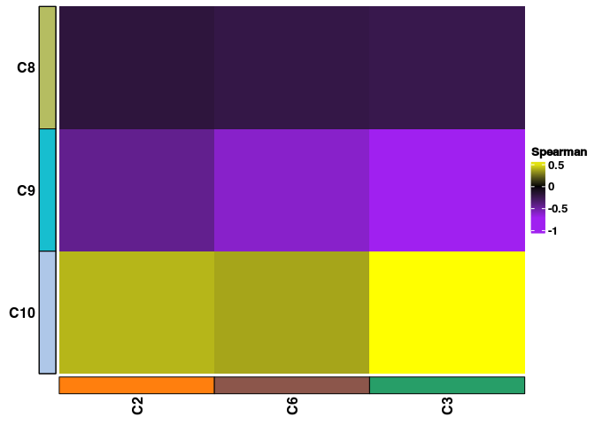
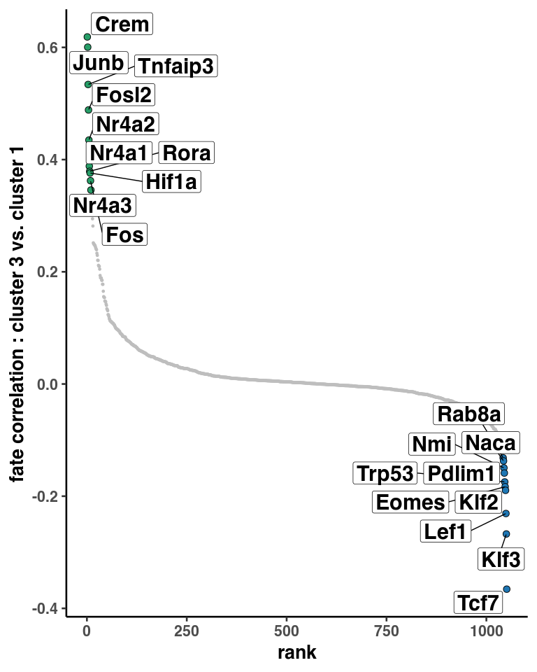

Figure 2
================

``` r
library(reticulate)
library(gtools)
library(tidyverse)
library(ggplot2)
library(ggrepel)
library(ComplexHeatmap)
library(circlize)

use_python("/projects/home/nealpsmith/.conda/envs/old_peg_github/bin/python")
```

``` python
import getpass
import pegasus as pg
```

    ## WARNING:param.Parameterized: Use method 'warning' via param namespace 
    ## WARNING:param.main: pandas could not register all extension types imports failed with the following error: cannot import name 'ABCIndexClass' from 'pandas.core.dtypes.generic' (/projects/home/nealpsmith/.conda/envs/old_peg_github/lib/python3.7/site-packages/pandas/core/dtypes/generic.py)

``` python
import scanpy as sc
import os
import matplotlib.pyplot as plt
import pandas as pd
import numpy as np
import anndata
import math
import seaborn as sns
import matplotlib.colors as clr
from pylab import cm
import matplotlib as mpl
from matplotlib.lines import Line2D
from mpl_toolkits.axes_grid1 import make_axes_locatable
from scipy.sparse import csr_matrix
from collections import Counter
import wot
import pickle

from cellrank.external.kernels import WOTKernel
from cellrank.tl.kernels import ConnectivityKernel
from cellrank.tl.estimators import GPCCA

mpl.rcParams['axes.spines.right'] = False
mpl.rcParams['axes.spines.top'] = False
# mpl.rcParams['pdf.fonttype'] = 42

# Set a colormap
gene_colormap = clr.LinearSegmentedColormap.from_list('gene_cmap', ["#e0e0e1", '#4576b8', '#02024a'], N=200)

cmap = cm.get_cmap('YlOrRd', 110)    # PiYG
hex_list = []
for i in range(cmap.N):
    rgba = cmap(i)
    # rgb2hex accepts rgb or rgba
    hex_list.append(mpl.colors.rgb2hex(rgba))

colors = [c for n, c in enumerate(hex_list) if n%10 == 0]
colors = colors [1:11] # First one is too dim
days = ["0", "2", "5", "10", "15", "20", "25", "30", "45", "60"]

day_col_dict = dict(zip(days, colors))
day_cmap = clr.LinearSegmentedColormap.from_list('day_cmap', colors, N=len(colors))

# Set a switcher up so the script will run on any computer
def file_path(user = getpass.getuser()):
    switcher = {
            "nealp": "C:/Users/nealp/Documents/Dropbox (Partners HealthCare)/Chloe&Mazen/Collaborator_projects/Kupper_TRM/neal_analysis/all_data_analysis",
            "neal": "/home/neal/Documents/Dropbox (Partners HealthCare)/Chloe&Mazen/Collaborator_projects/Kupper_TRM/neal_analysis/all_data_analysis",
            "nealpsmith": "/projects/home/nealpsmith/projects/kupper/all_data_analysis"

    }
    if switcher.get(user):
        return(switcher.get(user))
    else :
        print("Add your local filepath to the switcher! run getpass.getuser() to get your ID")

filtered2_no_skin2 = pg.read_input(
    os.path.join(file_path(), "data", "integrated", "filtered2_no_skin2_harmonized_with_subclust.h5ad"))
# Add a "C" in front of cluster number
```

    ## 2023-09-27 15:16:21,817 - pegasus - INFO - Time spent on 'read_input' = 5.05s.

``` python
filtered2_no_skin2.obs["new_clusters"] = [f"C{cl}" for cl in filtered2_no_skin2.obs["new_clusters"]]
```

``` python

annot_info = pd.read_csv("/projects/home/nealpsmith/projects/kupper/all_data_analysis/data/integrated/supplemental_tables/cluster_annotations.csv")
annot_info["cluster_number"] = [str(n) for n in annot_info["cluster_number"]]
# annot_dict = dict(zip(annot_info["cluster_number"], annot_info["annotation"]))
# filtered2_no_skin2.obs["annotation"] = [annot_dict[cl] for cl in filtered2_no_skin2.obs["new_clusters"]]

sorted_clusts = sorted(set(filtered2_no_skin2.obs["new_clusters"]), key = lambda s: int(s.split(":")[0].replace("C", "")))
col_dict = dict(zip(sorted_clusts,filtered2_no_skin2.uns["new_clusters_colors"]))


cl_8_9_10 = filtered2_no_skin2[filtered2_no_skin2.obs["new_clusters"].isin(["C8", "C9", "C10"])]

col_dict = dict(zip(sorted(set(cl_8_9_10.obs["new_clusters"]), key = lambda x : int(x.replace("C", ""))),
                    cl_8_9_10.uns["new_clusters_colors"]))

legend_elements = [Line2D([0], [0], marker='o', color=col_dict[cl], label=cl,
                          markerfacecolor=col_dict[cl], markersize=7, lw=0) for cl in
                   sorted(set(cl_8_9_10.obs["new_clusters"]), key = lambda x : int(x.replace("C", "")))]

fig, ax = plt.subplots(1)
plot = sc.pl.embedding(cl_8_9_10, basis = "fle", color="new_clusters",
                  legend_loc="on data", show=False, ax=ax,
                  title="", legend_fontoutline=5)
```

    ## /projects/home/nealpsmith/.conda/envs/old_peg_github/lib/python3.7/site-packages/anndata/_core/anndata.py:1235: ImplicitModificationWarning: Trying to modify attribute `.obs` of view, initializing view as actual.
    ##   df[key] = c

``` python
lgd = ax.legend(handles=legend_elements, loc='center left', fontsize = 15, bbox_to_anchor=(1, 0.5), frameon=False)
fig = plt.gcf()
fig.set_size_inches(4.2, 3)
fig.tight_layout()
ax.set_rasterization_zorder(2)
fig
```


``` python

gene_cats = {"cluster_8" : ["Ccl5", "Ifit1", "Isg20", "Btg1", "Hcst", "Sell"],
             "cluster_9" : ["Stmn1", "Mki67", "Pclaf", "Birc5", "Ezh2", "Cdk1"],
             "cluster_10" : ["Batf3", "Fabp5", "Fut7", "Il2ra", "Cxcr4", "Havcr2"]}
plot = sc.pl.dotplot(cl_8_9_10, gene_cats, groupby="new_clusters",
                     categories_order=["C8", "C9", "C10"],
                     show=False, return_fig=True, title="", cmap = "Blues", standard_scale="var")
axes_dict = plot.get_axes()
axes_dict["mainplot_ax"].set_axisbelow(True)
axes_dict["mainplot_ax"].grid()
fig = plt.gcf()
fig.set_size_inches(6, 4)
plt.subplots_adjust(bottom=0.19)

fig
```


``` r
ova_stats <- read.csv("/projects/home/nealpsmith/projects/kupper/all_data_analysis/data/integrated/filtered2_no_skin2_with_subclust/ova_pseudobulk_stats.csv")
annotation_info <- read.csv("/projects/home/nealpsmith/projects/kupper/all_data_analysis/data/heatmap_info/filtered2_no_skin2_annotation_genes.csv", row.names = 1)
colnames(annotation_info) <- sub("cluster_", "C", colnames(annotation_info))
ova_stats$cluster <- sub("cluster_", "C", ova_stats$cluster)

heatmap_df <- matrix(nrow = 3, ncol = 3) %>%
  `colnames<-`(c("C2", "C6", "C3")) %>%
  `rownames<-`(c("C8", "C9", "C10"))

for (c1 in rownames(heatmap_df)){
    c1_stats <- ova_stats %>%
      dplyr::filter(cluster == c1) %>%
      dplyr::select(feature, log_fc)
    for (c2 in colnames(heatmap_df)){
      c2_stats <- ova_stats %>%
        dplyr::filter(cluster == c2) %>%
        dplyr::select(feature, log_fc)

      corr_df <- c1_stats %>% dplyr::left_join(c2_stats, by = "feature") %>%
        na.omit()

      c <- cor(corr_df$log_fc.x, corr_df$log_fc.y, method = "spearman")
      heatmap_df[c1, c2] <- c
    }
}

heatmap_col_fun = colorRamp2(c(min(heatmap_df), 0, max(heatmap_df)), c("purple", "black", "yellow"))

# The right annotation
cl_cols <- annotation_info["col",] %>% as.character()
names(cl_cols) <- colnames(annotation_info)
left_annotation = HeatmapAnnotation(rows = rownames(heatmap_df),
                                    col = list(rows = cl_cols),
                                    gp = gpar(col = "black"),
                                    which = "row",
                                    annotation_width = unit(0.2, "mm"),
                                    show_legend = FALSE,
                                    show_annotation_name = FALSE,border = TRUE)
bottom_annotation = HeatmapAnnotation(columns = colnames(heatmap_df),
                                     col = list(columns = cl_cols),
                                      annotation_height = unit(0.2, "mm"),
                                      gp = gpar(col = "black"),
                                      show_legend = FALSE,
                                      show_annotation_name = FALSE)

hmap <- Heatmap(heatmap_df, name = "Spearman", col = heatmap_col_fun, cluster_rows = FALSE, cluster_columns = FALSE,
        left_annotation = left_annotation, bottom_annotation = bottom_annotation, row_names_side = "left")

draw(hmap)
```

<!-- -->

``` python

gs = wot.io.read_sets(os.path.join(file_path(), "data", "gene_sets", "gene_sets.gmt"),
                      filtered2_no_skin2.var.index.values)

for j in range(gs.shape[1]):
    gene_set_name = str(gs.var.index.values[j])
    result = wot.score_gene_sets(ds=filtered2_no_skin2, gs=gs[:, [j]], permutations=0, method='mean_z_score')
    filtered2_no_skin2.obs[gene_set_name] = result["score"]

# apply logistic function to transform to birth rate and death rate
def logistic(x, L, k, x0=0):
    f = L / (1 + np.exp(-k * (x - x0)))
    return f
def gen_logistic(p, beta_max, beta_min, pmax, pmin, center, width):
    return beta_min + logistic(p, L=beta_max - beta_min, k=4 / width, x0=center)

def beta(p, beta_max=1.7, beta_min=0.3, pmax=1.0, pmin=-0.5, center=0.25):
    return gen_logistic(p, beta_max, beta_min, pmax, pmin, center, width=0.5)

def delta(a, delta_max=1.7, delta_min=0.3, amax=0.5, amin=-0.4, center=0.1):
    return gen_logistic(a, delta_max, delta_min, amax, amin, center,
                          width=0.2)

birth = beta(filtered2_no_skin2.obs["CELL_CYCLE_PHASE"])
death = delta(filtered2_no_skin2.obs["HALLMARK_APOPTOSIS"])

gr = np.exp(birth-death)
filtered2_no_skin2.obs["cell_growth_rate"] = gr

col_dict = dict(zip(sorted(set(filtered2_no_skin2.obs["new_clusters"]), key=lambda x : int(x.replace("C", ""))), filtered2_no_skin2.uns["new_clusters_colors"]))

legend_elements = [Line2D([0], [0], color=col_dict[cl], label=cl,
                          markerfacecolor=col_dict[cl], lw=2) for cl in
                   sorted(set(filtered2_no_skin2.obs["new_clusters"]), key=lambda x : int(x.replace("C", "")))]

fig, ax = plt.subplots(1, figsize = (6, 6))
for clust in sorted(set(filtered2_no_skin2.obs["new_clusters"])) :
    data = filtered2_no_skin2.obs["cell_growth_rate"][filtered2_no_skin2.obs["new_clusters"] == clust]
    color = col_dict[clust]
    data = [np.log(val) for val in data]
    _ = sns.distplot(data, hist = False, color = color, ax = ax)
# ax.legend(handles=legend_elements, loc='center left', bbox_to_anchor=(0.85, 0.5), frameon=False, labelspacing = 0.1)
plt.xlabel("log growth-rate")
plt.title("growth rates by cluster")
fig
```


``` python

legend_elements = [Line2D([0], [0], color=day_col_dict[d], label=d,
                          markerfacecolor=day_col_dict[d], lw=2) for d in
                   sorted(set(filtered2_no_skin2.obs["day"]), key=int)]

fig, ax = plt.subplots(1, figsize = (6, 6))
for day in sorted(set(filtered2_no_skin2.obs["day"]), key = int) :
    color = day_col_dict[day]
    data = filtered2_no_skin2.obs["cell_growth_rate"][filtered2_no_skin2.obs["day"] == day]
    data = [np.log(val) for val in data]
    _ = sns.distplot(data, hist = False, color = color, ax = ax)
lgd = ax.legend(handles=legend_elements, loc='center left', bbox_to_anchor=(0.85, 0.5), frameon=False, labelspacing = 0.1)
plt.xlabel("log growth-rate")
plt.title("growth rates by day")
fig
```


``` python

### THIS CODE WILL NOT RUN WITHIN A NOTEBOOK BUT IS FOR FIGURE 2D ###

# if not os.path.exists("/projects/home/nealpsmith/projects/kupper/all_data_analysis/data/integrated/velocity/wot/wot_kernel.pickle") :
#     wk = WOTKernel(filtered2_no_skin2, time_key="day_int")
#     wk.compute_initial_growth_rates(proliferation_key="CELL_CYCLE_PHASE", apoptosis_key="HALLMARK_APOPTOSIS",
#                                     key_added="growth_rate_init")
#
#     scv.pl.scatter(
#         filtered2_no_skin2, c="growth_rate_init", legend_loc="right", basis="fle", s=10
#     )
#
#     wk.compute_transition_matrix(
#         growth_iters=3, growth_rate_key=None, last_time_point="connectivities",
#         use_highly_variable = "highly_variable_features"
#     )
#     with open('/projects/home/nealpsmith/projects/kupper/all_data_analysis/data/integrated/velocity/wot/wot_kernel.pickle', 'wb') as f:
#         pickle.dump(wk, f, protocol=4)
#
# else :
#     wk = pickle.load(open(
#         "/projects/home/nealpsmith/projects/kupper/all_data_analysis/data/integrated/velocity/wot/wot_kernel.pickle",
#         "rb"))

# if not os.path.exists("/projects/home/nealpsmith/projects/kupper/all_data_analysis/data/integrated/velocity/wot/gpcca_estimator.pickle") :
#     g = GPCCA(combined_kernel)
#     g.compute_schur()
#     with open('/projects/home/nealpsmith/projects/kupper/all_data_analysis/data/integrated/velocity/wot/gpcca_estimator.pickle', 'wb') as f:
#         pickle.dump(g, f, protocol=4)
# else :
#     g = pickle.load(open("/projects/home/nealpsmith/projects/kupper/all_data_analysis/data/integrated/velocity/wot/gpcca_estimator.pickle",
#             "rb"))
# n = 2
# g.compute_macrostates(n_states=n, cluster_key="new_clusters")
# g.plot_macrostate_composition(key="day")
# g.set_terminal_states_from_macrostates(["1", "3"])
# g.compute_absorption_probabilities(solver="gmres", use_petsc=True)
# g.plot_absorption_probabilities(same_plot=False, basis="fle", perc=[0, 99], show = True)
```

``` r
driver_genes = read.csv("/projects/home/nealpsmith/projects/kupper/all_data_analysis/data/integrated/velocity/wot/driver_genes.csv")
colnames(driver_genes) <- sapply(colnames(driver_genes), function(x) gsub("X", "c", x))

driver_genes <- driver_genes %>% drop_na(c1_corr)

tf_data = read.csv("/projects/home/nealpsmith/projects/kupper/all_data_analysis/data/integrated/mouse_transcription_factors.csv")
tfs <- tf_data$gene_name

driver_genes$tf <- ifelse(driver_genes$feature %in% tfs, "yes", "no")

tf_drivers <- driver_genes[driver_genes$tf == "yes",]

plot_df <- tf_drivers %>%
  arrange(-c3_corr) %>%
  mutate(rank = 1:nrow(.))

label_up <- plot_df %>%
  head(10) %>%
  .$feature
label_down <- plot_df %>%
  tail(10) %>%
  .$feature

all_labels <- c(label_up, label_down)

ggplot(plot_df, aes(x = rank, y = c3_corr)) +
  geom_point(data = plot_df[!plot_df$feature %in% all_labels,], color = "grey", size = 1) +
  geom_point(data = plot_df[plot_df$feature %in% label_up,], pch = 21, fill = "#279e68", size = 3) +
  geom_point(data = plot_df[plot_df$feature %in% label_down,], pch = 21, fill = "#1f77b4", size = 3) +
  ylab("fate correlation : cluster 3 vs. cluster 1") +
  geom_label_repel(data = plot_df[plot_df$feature %in% all_labels,], aes(label = feature), max.overlaps = 30, size = 8) +
  theme_classic(base_size = 20)
```

<!-- -->
