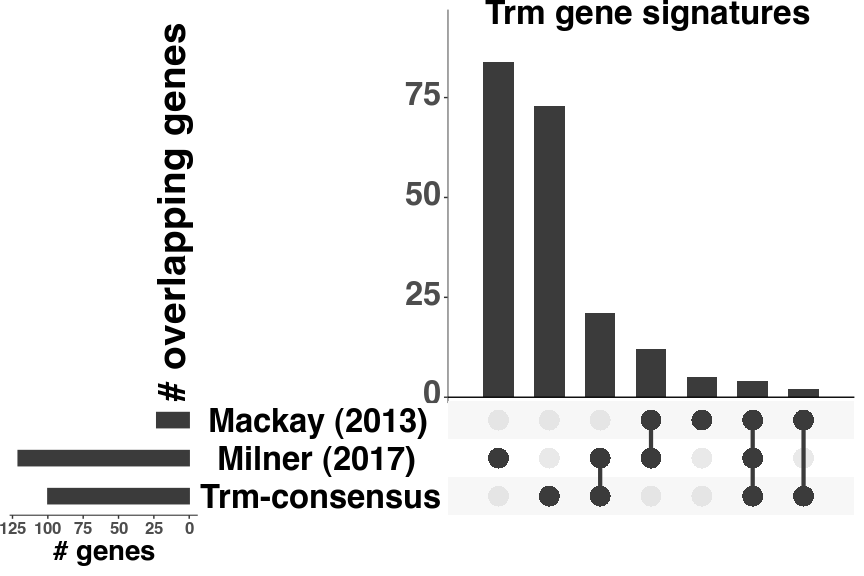
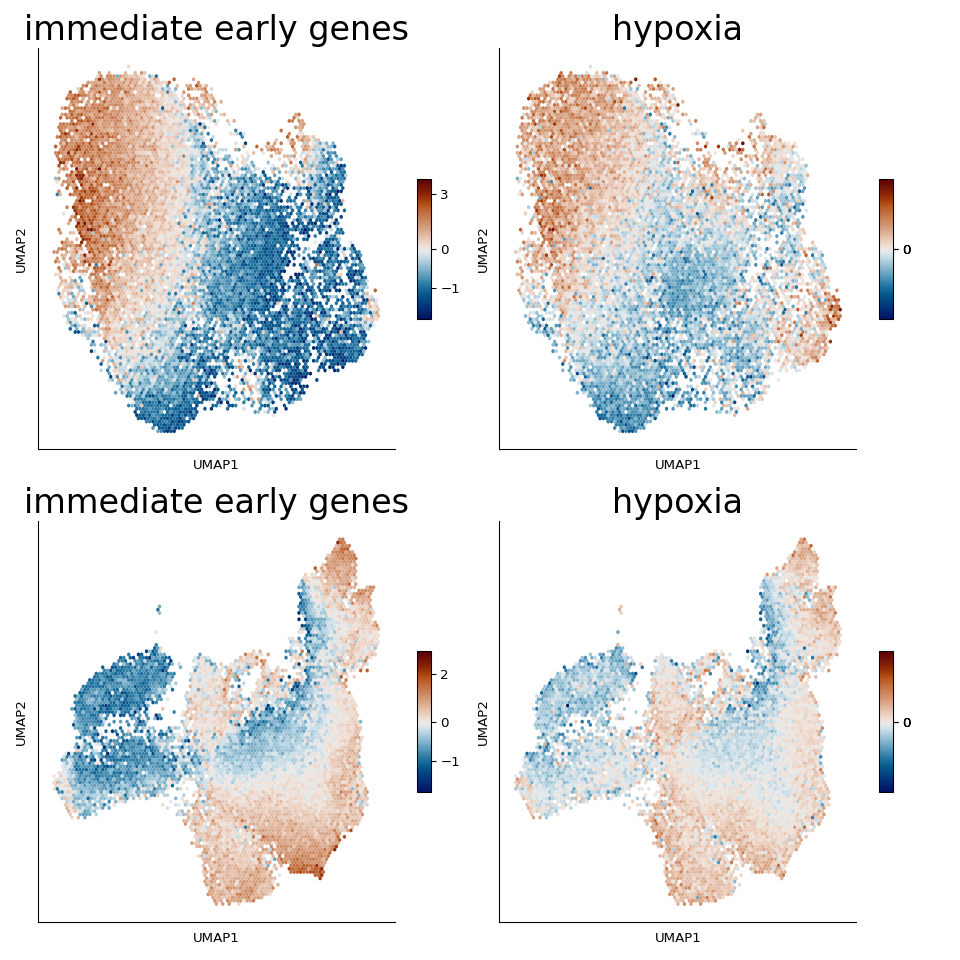

Figure 4
================

``` r
library(reticulate)
library(gtools)
library(tidyverse)
library(ggplot2)
library(DESeq2)
library(glue)
library(magrittr)
library(VennDiagram)
library(ComplexHeatmap)
library(circlize)
library(ggpubr)
library(ggrepel)
library(UpSetR)
library(affy)
library(mogene10sttranscriptcluster.db)

use_python("/projects/home/nealpsmith/.conda/envs/old_peg_github/bin/python")

godsnot_102 = c(
  # "#FFFF00", Yellow isn't great
  #"#1CE6FF", # This one is kinda ugly too
  "#FF34FF", "#FF4A46", "#008941", "#006FA6", "#A30059",
  "#FFDBE5", "#7A4900", "#0000A6", "#63FFAC", "#B79762", "#004D43", "#8FB0FF", "#997D87",
  "#5A0007", "#809693", "#6A3A4C", "#1B4400", "#4FC601", "#3B5DFF", "#4A3B53", "#FF2F80",
  "#61615A", "#BA0900", "#6B7900", "#00C2A0", "#FFAA92", "#FF90C9", "#B903AA", "#D16100",
  "#DDEFFF", "#000035", "#7B4F4B", "#A1C299", "#300018", "#0AA6D8", "#013349", "#00846F",
  "#372101", "#FFB500", "#C2FFED", "#A079BF", "#CC0744", "#C0B9B2", "#C2FF99", "#001E09",
  "#00489C", "#6F0062", "#0CBD66", "#EEC3FF", "#456D75", "#B77B68", "#7A87A1", "#788D66",
  "#885578", "#FAD09F", "#FF8A9A", "#D157A0", "#BEC459", "#456648", "#0086ED", "#886F4C",
  "#34362D", "#B4A8BD", "#00A6AA", "#452C2C", "#636375", "#A3C8C9", "#FF913F", "#938A81",
  "#575329", "#00FECF", "#B05B6F", "#8CD0FF", "#3B9700", "#04F757", "#C8A1A1", "#1E6E00",
  "#7900D7", "#A77500", "#6367A9", "#A05837", "#6B002C", "#772600", "#D790FF", "#9B9700",
  "#549E79", "#FFF69F", "#201625", "#72418F", "#BC23FF", "#99ADC0", "#3A2465", "#922329",
  "#5B4534", "#FDE8DC", "#404E55", "#0089A3", "#CB7E98", "#A4E804", "#324E72"
)
```

``` python
import getpass
import pegasus as pg
```

    ## WARNING:param.Parameterized: Use method 'warning' via param namespace 
    ## WARNING:param.main: pandas could not register all extension types imports failed with the following error: cannot import name 'ABCIndexClass' from 'pandas.core.dtypes.generic' (/projects/home/nealpsmith/.conda/envs/old_peg_github/lib/python3.7/site-packages/pandas/core/dtypes/generic.py)

``` python
import scanpy as sc
import os
import matplotlib.pyplot as plt
import pandas as pd
import numpy as np
import anndata
import math
import seaborn as sns
import matplotlib.colors as clr
from pylab import cm
import matplotlib as mpl
from matplotlib.lines import Line2D
from mpl_toolkits.axes_grid1 import make_axes_locatable
from scipy.sparse import csr_matrix
from collections import Counter
from cmcrameri import cm as cmc

mpl.rcParams['axes.spines.right'] = False
mpl.rcParams['axes.spines.top'] = False
# mpl.rcParams['pdf.fonttype'] = 42

# Set a colormap
gene_colormap = clr.LinearSegmentedColormap.from_list('gene_cmap', ["#e0e0e1", '#4576b8', '#02024a'], N=200)

# Set a switcher up so the script will run on any computer
def file_path(user = getpass.getuser()):
    switcher = {
            "nealp": "C:/Users/nealp/Documents/Dropbox (Partners HealthCare)/Chloe&Mazen/Collaborator_projects/Kupper_TRM/neal_analysis",
            "neal": "/home/neal/Documents/Dropbox (Partners HealthCare)/Chloe&Mazen/Collaborator_projects/Kupper_TRM/neal_analysis",
            "nealpsmith": "/projects/home/nealpsmith/projects/kupper"

    }
    if switcher.get(user):
        return(switcher.get(user))
    else :
        print("Add your local filepath to the switcher! run getpass.getuser() to get your ID")
```

``` python

cmap = cm.get_cmap('YlGnBu', 140)    # PiYG
hex_list = []
for i in range(cmap.N):
    rgba = cmap(i)
    # rgb2hex accepts rgb or rgba
    hex_list.append(mpl.colors.rgb2hex(rgba))

colors = [c for n, c in enumerate(hex_list) if n%10 == 0]
colors = colors [1:13] # First one is too dim
days = ["0", "3", "4", "5", "6", "7", "10", "14", "21", "32", "60", "90"]

day_col_dict = dict(zip(days, colors))
# Also make as a colormap
kurd_day_cmap = clr.LinearSegmentedColormap.from_list('day_cmap', colors, N=len(colors))

cmap = cm.get_cmap('YlOrRd', 110)    # PiYG
hex_list = []
for i in range(cmap.N):
    rgba = cmap(i)
    # rgb2hex accepts rgb or rgba
    hex_list.append(mpl.colors.rgb2hex(rgba))

colors = [c for n, c in enumerate(hex_list) if n%10 == 0]
colors = colors [1:11] # First one is too dim
days = ["0", "2", "5", "10", "15", "20", "25", "30", "45", "60"]

day_col_dict = dict(zip(days, colors))
kupper_day_cmap = clr.LinearSegmentedColormap.from_list('day_cmap', colors, N=len(colors))

# Make a gene colormap too
gene_colormap = clr.LinearSegmentedColormap.from_list('gene_cmap', ["#d3d3d3", '#482cc7'], N=200)

gut1_data = pg.read_input(os.path.join(file_path(), "kurd_paper", "data", "gut1_data_subcluster.h5ad"))
```

    ## 2023-08-14 15:05:47,180 - pegasus - INFO - Time spent on 'read_input' = 2.96s.

``` python
skin1_data = pg.read_input(os.path.join(file_path(), "all_data_analysis", "data", "integrated", "skin1_subcluster.h5ad"))
```

    ## 2023-08-14 15:05:48,545 - pegasus - INFO - Time spent on 'read_input' = 1.36s.

``` python
skin1_data.obs["day"] = [int(d) for d in skin1_data.obs["day"]]
data_dict = {"skin" : skin1_data, "siIEL" : gut1_data}
day_cmaps = {"skin": kupper_day_cmap, "siIEL" : kurd_day_cmap}
```

``` r
padj_cutoff = 0.1
perc_cells_cutoff = 5
slope_cutoff = 0.2

# Load in the counts and metadata
count_data_kupper <- read.csv("/projects/home/nealpsmith/projects/kupper/all_data_analysis/data/integrated/skin1_subcluster_pseudobulk_on_time_counts.csv", row.names = 1)
meta_data_kupper <- read.csv("/projects/home/nealpsmith/projects/kupper/all_data_analysis/data/integrated/skin1_subcluster_pseudobulk_on_time_meta.csv",
                  row.names = 1)

meta_temp <- meta_data_kupper[meta_data_kupper$n_cells > 100,]

# Remove the extra D30 sample, seems unfair to only have 2 samples for one timepoint
meta_temp <- meta_temp[rownames(meta_temp) != "samp_19_D30_Skin_30",]
# Need to adjust the int to the lowest point
meta_temp$day_int <- meta_temp$day_int - 2

count_temp <- count_data_kupper[,rownames(meta_temp)]

# Make sure the genes are detected in enough samples
n_samp <- rowSums(count_temp != 0)
count_temp <- count_temp[n_samp > round(nrow(meta_temp) / 2),]
count_temp <- count_temp[!grepl("Gm[0-9]|Rpl|Rps|mt-|-ps", rownames(count_temp)),]

# Okay now we can run DESeq
dds_kupper <- DESeqDataSetFromMatrix(countData = count_temp,
                            colData = meta_temp,
                            design = ~day_int)
dds_kupper <- DESeq(dds_kupper)
skin_res <- as.data.frame(results(dds_kupper))
skin_res <- skin_res[!is.na(skin_res$padj),]
skin_res$gene <- rownames(skin_res)
# Read in the single cell gene info
gene_info <- read.csv("/projects/home/nealpsmith/projects/kupper/all_data_analysis/data/integrated/skin1_subcluster_gene_info.csv") %>%
  rename(feature = "gene")

skin_res %<>%
  left_join(gene_info, by = "gene")

skin_de <- skin_res[skin_res$padj < padj_cutoff & abs(skin_res$log2FoldChange) > slope_cutoff
                  & skin_res$percent_cells > perc_cells_cutoff,] %>%
    arrange(padj)

#### Now the gut modeling ####

# Load in the counts and metadata
count_data_kurd <- read.csv("/projects/home/nealpsmith/projects/kupper/kurd_paper/data/gut1_data_subcluster_pseudobulk_on_time_counts.csv",
                     row.names = 1)
meta_data_kurd <- read.csv("/projects/home/nealpsmith/projects/kupper/kurd_paper/data/gut1_data_subcluster_pseudobulk_on_time_meta.csv",
                  row.names = 1)

meta_temp <- meta_data_kurd[meta_data_kurd$n_cells > 100,]
count_temp <- count_data_kurd[,rownames(meta_temp)]

# Make sure the genes are detected in enough samples
n_samp <- rowSums(count_temp != 0)
count_temp <- count_temp[n_samp > round(nrow(meta_temp) / 2),]
count_temp <- count_temp[!grepl("Gm[0-9]|Rpl|Rps|mt-|-ps", rownames(count_temp)),]

# Okay now we can run DESeq
dds_kurd <- DESeqDataSetFromMatrix(countData = count_temp,
                            colData = meta_temp,
                            design = ~day_int)
dds_kurd <- DESeq(dds_kurd)
gut_res <- as.data.frame(results(dds_kurd))
gut_res <- gut_res[!is.na(gut_res$padj),]
gut_res$gene <- rownames(gut_res)
# Read in the single cell gene info
gene_info <- read.csv("/projects/home/nealpsmith/projects/kupper/kurd_paper/data/gut1_data_subcluster_gene_info.csv") %>%
rename(feature = "gene")

gut_res %<>%
  left_join(gene_info, by = "gene")

gut_de <- gut_res[gut_res$padj < padj_cutoff & abs(gut_res$log2FoldChange) > slope_cutoff
                    & gut_res$percent_cells > perc_cells_cutoff,] %>%
  arrange(padj)

skin_mem <- skin_de[skin_de$log2FoldChange > 0,]
gut_mem <- gut_de[gut_de$log2FoldChange > 0,]

skin_genes <- skin_mem$gene
gut_genes <- gut_mem$gene
kupper_trm <- intersect(skin_genes, gut_genes)
```

``` r
heatmap_genes <-c(kupper_trm)

vsd_kupper <- vst(dds_kupper, blind=TRUE)
norm_res_kupper <- assay(vsd_kupper)

vsd_kurd <- vst(dds_kurd, blind = TRUE)
norm_res_kurd <- assay(vsd_kurd)

heatmap_mtx <- norm_res_kupper[heatmap_genes,]
heatmap_mtx <- t(scale(t(heatmap_mtx)))


colnames(heatmap_mtx) <- sapply(colnames(heatmap_mtx), function(x) strsplit(x, "_")[[1]][3])

# Now the clustering
clustering = hclust(dist(t(heatmap_mtx), method = "euclidean"), method = "ward.D2")
col_hc <- as.dendrogram(clustering)

col_hc[[1]] <- rev(col_hc[[1]])

temp <- col_hc[[2]][[1]]
col_hc[[2]][[1]] <- col_hc[[2]][[2]]
col_hc[[2]][[2]] <- temp

temp <- col_hc[[2]][[2]][[1]]
col_hc[[2]][[2]][[1]] <- col_hc[[2]][[2]][[2]]
col_hc[[2]][[2]][[2]] <- temp

# Day bar
days <- colnames(heatmap_mtx)

# Now make the day annotation
day_colors = list("Day" = c('D0'= '#fff2ac',
                            'D2'= '#ffe48c',
                            'D5'= '#fed16e',
                            'D10'= '#feb54f',
                            'D15'= '#fd9941',
                            'D20'= '#fd7435',
                            'D25'= '#f94728',
                            'D30'= '#e6211e',
                            'D45'= '#cc0a22',
                            'D60'= '#a80026'))

days <- factor(days, levels = c("D0", "D2", "D5", "D10", "D15", "D20", "D25", "D30", "D45", "D60"))
days <- droplevels(days)
day_bar = HeatmapAnnotation("Day" = days, col = day_colors,
                            show_legend = FALSE, show_annotation_name = FALSE)
# Heatmap colors
heatmap_col_fun = colorRamp2(c(min(heatmap_mtx), 0, max(heatmap_mtx)), c("purple", "black", "yellow"))

# Lets make the legends
day_fill <- sapply(levels(days), function(x) day_colors$Day[as.character(x)])
day_legend_skin <- Legend(labels = levels(days), legend_gp = gpar(fill = day_fill), title = "timepoint (Skin)")

heatmap_lgd = Legend(col_fun = heatmap_col_fun, title = "z-score", legend_height = unit(4, "cm"), title_position = "topcenter")

# lgd_list <- packLegend(heatmap_lgd, day_legend_skin, column_gap = unit(1,"cm"), direction = "vertical",
#                      max_height = unit(14, "cm"))

# Now make the split
ln_de <- read.csv("/projects/home/nealpsmith/projects/kupper/all_data_analysis/data/integrated/pseudobulk/lin_modelling_subclusters/lymph_by_day_all_genes.csv",
                    row.names = 1)

spleen_de <- read.csv("/projects/home/nealpsmith/projects/kupper/kurd_paper/data/pseudobulk/lin_modelling_subclusters/spleen1_by_day_all_genes.csv",
                   row.names = 1)
ln_mem <- ln_de[ln_de$log2FoldChange > 0.2 & ln_de$padj < 0.1 & ln_de$percent_cells > 5,]
spleen_mem <- spleen_de[spleen_de$log2FoldChange > 0.2 & spleen_de$padj < 0.1 & spleen_de$percent_cells > 5,]
ln_genes <- ln_mem$gene
spleen_genes <- spleen_mem$gene
kupper_tcm <- intersect(ln_mem$gene, spleen_mem$gene)

mem_genes <- kupper_trm[kupper_trm %in% kupper_tcm]
trm_genes <- kupper_trm[!kupper_trm %in% kupper_tcm]
heatmap_mtx <- heatmap_mtx[c(trm_genes, mem_genes),]

split <- c(rep("Trm-consensus", length(trm_genes)), rep("memory", length(mem_genes)))
split <- factor(split, levels = c("Trm-consensus", "memory"))

kupper_hmap = Heatmap(heatmap_mtx, name = "z-score", col = heatmap_col_fun,
                 top_annotation = day_bar, show_column_names = FALSE, show_row_names = FALSE,
                 cluster_columns = col_hc, cluster_rows = FALSE, show_heatmap_legend = FALSE,
                      column_title = "Skin", split = split)

heatmap_mtx_kurd <- norm_res_kurd[heatmap_genes,]

# Get the average of the repeated timepoints
colname_to_tmpt <- lapply(colnames(heatmap_mtx_kurd), function(x) paste("D", tail(strsplit(x, "_")[[1]], n = 1), sep = ""))
tmpts <- unique(sapply(colnames(heatmap_mtx_kurd), function(x) tail(strsplit(x, "_")[[1]], n = 1)))

heatmap_mtx_kurd <- lapply(tmpts, function(tpt){
  cols = as.data.frame(heatmap_mtx_kurd[,grepl(glue("*_{tpt}$"), colnames(heatmap_mtx_kurd))])
  if(ncol(cols) > 1){
   mean = rowMeans(cols) %>%
    as.data.frame() %>%
    `colnames<-`(glue("D{tpt}")) %>%
     rownames_to_column("gene")
  return(mean)
  } else {
    cols <- cols %>%
      `colnames<-`(glue("D{tpt}")) %>%
     rownames_to_column("gene")
    return(cols)
  }
}) %>%
  purrr::reduce(left_join, by = "gene") %>%
  column_to_rownames("gene")


heatmap_mtx_kurd <- t(scale(t(heatmap_mtx_kurd)))

# colnames(heatmap_mtx_kurd) <- sapply(colnames(heatmap_mtx_kurd), function(x) paste("D", tail(strsplit(x, "_")[[1]], n = 1), sep = ""))

# Now the clustering
clustering = hclust(dist(t(heatmap_mtx_kurd), method = "euclidean"), method = "ward.D2")
col_hc <- as.dendrogram(clustering)

temp <- col_hc[[2]][[2]][[1]]
col_hc[[2]][[2]][[1]] <- col_hc[[2]][[2]][[2]]
col_hc[[2]][[2]][[2]] <- temp

days <- colnames(heatmap_mtx_kurd)

day_colors = list("Day" = c('D0'= '#f5fbc2',
                            'D3'= '#e7f6b1',
                            'D4'= '#d1edb3',
                            'D5'= '#b1e1b6',
                            'D6'= '#88d0ba',
                            'D7'= '#63c3bf',
                            'D10'= '#40b5c4',
                            'D14'= '#2ba0c2',
                            'D21'= '#1e88bc',
                            'D32'= '#216aae',
                            'D60'= '#2350a1',
                            'D90'= '#253896'))

days <- factor(days, levels = c("D0", "D3", "D4", "D5", "D6", "D7", "D10", "D14", "D21", "D32", "D60", "D90"))
days <- droplevels(days)
day_bar = HeatmapAnnotation("Day" = days, col = day_colors,
                            show_legend = FALSE)

# Heatmap colors
heatmap_col_fun = colorRamp2(c(min(heatmap_mtx_kurd), 0, max(heatmap_mtx_kurd)), c("purple", "black", "yellow"))

# Lets make the legends
day_fill <- sapply(levels(days), function(x) day_colors$Day[as.character(x)])
day_legend_gut <- Legend(labels = levels(days), legend_gp = gpar(fill = day_fill), title = "timepoint (siIEL)")

heatmap_lgd = Legend(col_fun = heatmap_col_fun, title = "z-score", legend_height = unit(4, "cm"), title_position = "topcenter")

lgd_list <- packLegend(heatmap_lgd, day_legend_skin, day_legend_gut, column_gap = unit(1,"cm"), direction = "vertical",
                     max_height = unit(20, "cm"))

### Lets make another one where we label genes categorically ###
label_genes <- list("Immediate Early genes" = c("Fosb", "Nr4a3", "Fosl2", "Fos", "Cebpb"),
                    "hypoxia" = c("Tiparp", "Dusp1", "Klf6", "Rora", "Cdkn1a"),
                    "anti-proliferative" = c("Cdip1", "Tob2", "Gadd45a", "Irf2bp2", "Klf4", "Dnajb4", "Dnaja1"),
                    # "other" = c("Id3", "Il21r", "Il4ra", "Itgae", "Tnf"),
                    "shared memory" = c("Bcl2", "Btg2"#,
                                        # "Zfp36l1", "Dennd4a"
                                        ))

gene_cols <- c()
for (set in seq_along(label_genes)){
  gene_cols <- c(gene_cols, rep(godsnot_102[[set]], length(label_genes[[set]])))
}
all_genes <- unlist(label_genes, use.names = FALSE)
gene_legend <- Legend(labels = names(label_genes), legend_gp = gpar(fill = unique(gene_cols)),
                      title = "")

lgd_list <- packLegend(heatmap_lgd, day_legend_skin, day_legend_gut, gene_legend,
                       column_gap = unit(1,"cm"), direction = "vertical",
                       max_height = unit(20, "cm"))
heatmap_mtx_kurd <- heatmap_mtx_kurd[c(trm_genes, mem_genes),]

kurd_hmap = Heatmap(heatmap_mtx_kurd, name = "z-score", col = heatmap_col_fun,
               top_annotation = day_bar,
               show_column_names = FALSE,
               show_row_names = FALSE,
               cluster_columns = col_hc, show_heatmap_legend = FALSE,
                    column_title = "siIEL", split = split, cluster_rows = FALSE) +
  rowAnnotation(link = anno_mark(at = match(all_genes, rownames(heatmap_mtx_kurd)),labels = all_genes,
                                 labels_gp = gpar(col = gene_cols, fontsize = 12, fontface = "bold")))

hmap_list <- kupper_hmap + kurd_hmap
draw(hmap_list, heatmap_legend_list = lgd_list)
```

<!-- -->

``` python

### Look at biological categories of genes ###
gene_cats = {"immediate_early_genes" : ["Fos", "Fosb", "Fosl2", "Gem", "Junb", "Zfp36l1", "Nr4a2", "Nr4a1",
                                                  "Dennd4a", "Ifrd1", "Rel", "Nr4a3", "Egr1", "Dusp1"],
             "hypoxia" : ["Tiparp","Cdkn1a","Ppp1r15a","Errfi1","Zfp36","Tnfaip3",
                          "Dusp1","Klf6","Rora"]}

pg.calc_signature_score(gut1_data, signatures=gene_cats, n_bins = 2)
```

    ## 2023-08-14 15:06:04,572 - pegasus - INFO - Time spent on 'calc_signature_score' = 0.72s.

``` python
pg.calc_signature_score(skin1_data, signatures=gene_cats, n_bins = 2)
```

    ## 2023-08-14 15:06:04,887 - pegasus - INFO - Time spent on 'calc_signature_score' = 0.31s.

``` python
data_dict = {"skin" : skin1_data, "siIEL" : gut1_data}

fig, ax = plt.subplots(nrows=2, ncols=2, figsize=(10, 10))
ax = ax.ravel()
num = 0
for tissue in data_dict.keys():
    for name in gene_cats.keys() :
        print(num)
        dat = data_dict[tissue]
        plot_df = pd.DataFrame(dat.obs[name], columns=[name], index=dat.obs_names)
        plot_df["x"] = dat.obsm["X_umap"][:, 0]
        plot_df["y"] = dat.obsm["X_umap"][:, 1]
        vmin = np.min(plot_df[name])
        vmax = np.max(plot_df[name])
        norm = clr.TwoSlopeNorm(vmin=vmin, vcenter=0, vmax=vmax)
        hb = ax[num].hexbin(plot_df["x"], plot_df["y"], C=plot_df[name], cmap=cmc.vik, norm = norm, gridsize=100, edgecolors = "none")
        cb = fig.colorbar(hb, ax=ax[num], aspect=10, shrink = 0.35, ticks = [round(vmin + 0.5), 0, round(vmax - 0.5)])
        ax[num].get_xaxis().set_ticks([])
        ax[num].get_yaxis().set_ticks([])
        ax[num].spines['top'].set_visible(False)
        ax[num].spines['right'].set_visible(False)
        ax[num].set_xlabel("UMAP1")
        ax[num].set_ylabel("UMAP2")
        ax[num].set_title(name.replace("_", " "), size=25)
        fig.tight_layout()
        num +=1
fig
```



``` r
# Now need to log-norm
norm_res_kupper <- apply(count_data_kupper, 2, function(c){
  n_total <- sum(c)
  per_100k <- (c * 1000000) / n_total
  return(per_100k)
})

norm_res_kupper <- log1p(norm_res_kupper)
# To be consistent with the DEGs, removing the second D30 sample, but doesn't really matter. Follows the same pattern

norm_res_kupper <- norm_res_kupper[,colnames(norm_res_kupper) != "samp_19_D30_Skin_30"]


# Can we change the column names to just be timepoints?
colnames(norm_res_kupper) <- sapply(colnames(norm_res_kupper), function(x) strsplit(x, "_")[[1]][3])

norm_res_kurd <- apply(count_data_kurd, 2, function(c){
  n_total <- sum(c)
  per_100k <- (c * 1000000) / n_total
  return(per_100k)
})
norm_res_kurd <- log1p(norm_res_kurd)

# Get the average of the repeated timepoints
colname_to_tmpt <- lapply(colnames(norm_res_kurd), function(x) paste("D", tail(strsplit(x, "_")[[1]], n = 1), sep = ""))
tmpts <- unique(sapply(colnames(norm_res_kurd), function(x) tail(strsplit(x, "_")[[1]], n = 1)))

norm_res_kurd <- lapply(tmpts, function(tpt){
  cols = as.data.frame(norm_res_kurd[,grepl(glue("*_{tpt}$"), colnames(norm_res_kurd))])
  if(ncol(cols) > 1){
   mean = rowMeans(cols) %>%
    as.data.frame() %>%
    `colnames<-`(glue("D{tpt}")) %>%
     rownames_to_column("gene")
  return(mean)
  } else {
    cols <- cols %>%
      `colnames<-`(glue("D{tpt}")) %>%
     rownames_to_column("gene")
    return(cols)
  }
}) %>%
  purrr::reduce(left_join, by = "gene") %>%
  column_to_rownames("gene")


# Now make the day annotation
day_colors = c('skin_D0'= '#fff2ac',
               'skin_D2'= '#ffe48c',
               'skin_D5'= '#fed16e',
               'skin_D10'= '#feb54f',
               'skin_D15'= '#fd9941',
               'skin_D20'= '#fd7435',
               'skin_D25'= '#f94728',
               'skin_D30'= '#e6211e',
               'skin_D45'= '#cc0a22',
               'skin_D60'= '#a80026',
               'siIEL_D0'= '#f5fbc2',
               'siIEL_D3'= '#e7f6b1',
               'siIEL_D4'= '#d1edb3',
               'siIEL_D5'= '#b1e1b6',
               'siIEL_D6'= '#88d0ba',
               'siIEL_D7'= '#63c3bf',
               'siIEL_D10'= '#40b5c4',
               'siIEL_D14'= '#2ba0c2',
               'siIEL_D21'= '#1e88bc',
               'siIEL_D32'= '#216aae',
               'siIEL_D60'= '#2350a1',
               'siIEL_D90'= '#253896')

# Fos genes
genes_oi <- c("Fos", "Fosl2", "Fosb")

gene_pairs <- data.frame("gene1" = rep("Itgae", length(genes_oi)),
                         "gene2" = genes_oi)
plot_list <- list()
for (i in 1:nrow(gene_pairs)){
  g1 <- gene_pairs[i, "gene1"]
  g2 <- gene_pairs[i, "gene2"]

  plot_info_kupper <- norm_res_kupper[c(g1, g2),] %>%
    t() %>%
    as.data.frame() %>%
    rownames_to_column(var = "tmpt") %>%
    mutate(tmpt_tissue = paste("skin", tmpt, sep = "_"))

  plot_info_kurd <- norm_res_kurd[c(g1, g2),] %>%
    t() %>%
    as.data.frame() %>%
    rownames_to_column(var = "tmpt") %>%
    mutate(tmpt_tissue = paste("siIEL", tmpt, sep = "_"))

  plot_df <- rbind(plot_info_kupper, plot_info_kurd)

  plot_df$tmpt_tissue <- factor(plot_df$tmpt_tissue, levels = names(day_colors))

  p <- ggplot(plot_df, aes_string(x = g1, y = g2, fill = "tmpt_tissue")) +
    geom_point(pch = 21, size = 5) +
    scale_fill_manual(values = day_colors) +
    xlab(glue("Log(CPM) : {g1}")) +
    ylab(glue("Log(CPM) : {g2}")) +
    # ggtitle(glue("{g2} vs. {g1}")) +
    theme_classic(base_size = 20)
  plot_df$tmpt_int <- sapply(plot_df$tmpt, function(x) as.numeric(sub("D", "", x)))
  plot_df$tissue <- sapply(as.character(plot_df$tmpt_tissue), function(x) strsplit(x, "_")[[1]][1])
  plot_df$tmpt_int <- factor(plot_df$tmpt_int)

  plot_list <- c(plot_list, list(p))
}
plots <- ggarrange(plotlist = plot_list, common.legend = TRUE, ncol = 3)
plots
```

<!-- -->

``` r
# ### First the siIEL ###
gut1_aucell <- read.csv('/projects/home/nealpsmith/projects/kupper/pyscenic/res/gut1/gut1.auc_with_timepoint.csv', row.names = 1)
colnames(gut1_aucell) <- sapply(colnames(gut1_aucell), function(x) sub("...", "", x, fixed = TRUE))
gut1_aucell$day <- paste("d", gut1_aucell$day, sep = "")
gut_day_int <- list("d4" = 0, "d7" = 1, "d10" = 2, "d14" = 3, "d21" = 4, "d32" = 5, "d60" = 6, "d90" = 7)

# Filter to just regulons that meet criteria
gut1_regulon_genes <-read.csv("/projects/home/nealpsmith/projects/kupper/kurd_paper/data/pyscenic/gut1/gut1_regulon_genes.csv",
                            row.names = 1)
gut_keep <- intersect(colnames(gut1_regulon_genes), colnames(gut1_aucell))
gut1_aucell <- gut1_aucell[,c(gut_keep, "day")]

gut1_aucell$day_int <- sapply(gut1_aucell$day, function(x) gut_day_int[[x]])

mean_auc_gut <- gut1_aucell %>%
  reshape2::melt(id.vars = c("day", "day_int")) %>%
  group_by(day, day_int, variable) %>%
  summarise(mean_aucell = mean(value)) %>%
  mutate(tissue = "gut")

# Use lienar model to calculate p-values
lm_gut <- lapply(unique(mean_auc_gut$variable), function(reg){
  reg_df <- mean_auc_gut %>%
    dplyr::filter(variable == reg)
  lin_model <- summary(lm(mean_aucell ~ day_int, data = reg_df))
  stat_info <- data.frame(regulon = reg,
                          gut_r_squared = lin_model$r.squared,
                          gut_p_val = as.numeric(lin_model$coefficients[,4][2]),
                          gut_slope = as.numeric(lin_model$coefficients[,1][2]))


  return(stat_info)
}) %>%
  do.call(rbind, .)

lm_gut$gut_adj_pval <- p.adjust(lm_gut$gut_p_val, method = "fdr")

### Now the Skin ###
skin1_aucell <- read.csv('/projects/home/nealpsmith/projects/kupper/pyscenic/res/skin1/skin1.auc_with_timepoint.csv', row.names = 1)
colnames(skin1_aucell) <- sapply(colnames(skin1_aucell), function(x) sub("...", "", x, fixed = TRUE))
skin1_aucell$day <- paste("d", skin1_aucell$day, sep = "")
skin_day_int <- list("d5" = 0, "d10" = 1, "d15" = 2, "d20" = 3, "d25" = 4, "d30" = 5, "d45" = 6, "d60" = 7)

skin1_regulon_genes <- read.csv("/projects/home/nealpsmith/projects/kupper/all_data_analysis/data/integrated/pyscenic/skin1/skin1_regulon_genes.csv",
                            row.names = 1)
skin_keep <- intersect(colnames(skin1_regulon_genes), colnames(skin1_aucell))
skin1_aucell <- skin1_aucell[,c(skin_keep, "day")]

skin1_aucell$day_int <- sapply(skin1_aucell$day, function(x) skin_day_int[[x]])

mean_auc_skin <- skin1_aucell %>%
  reshape2::melt(id.vars = c("day", "day_int")) %>%
  group_by(day, day_int, variable) %>%
  summarise(mean_aucell = mean(value)) %>%
  mutate(tissue = "skin")

# Use lienar model to calculate p-values
lm_skin <- lapply(unique(mean_auc_skin$variable), function(reg){
  reg_df <- mean_auc_skin %>%
    dplyr::filter(variable == reg)
  lin_model <- summary(lm(mean_aucell ~ day_int, data = reg_df))
  stat_info <- data.frame(regulon = reg,
                          skin_r_squared = lin_model$r.squared,
                          skin_p_val = as.numeric(lin_model$coefficients[,4][2]),
                          skin_slope = as.numeric(lin_model$coefficients[,1][2]))
  return(stat_info)
}) %>%
  do.call(rbind, .)

lm_skin$skin_adj_pval <- p.adjust(lm_skin$skin_p_val, method = "fdr")

all_mean_auc <- rbind(mean_auc_skin, mean_auc_gut)
genes_oi <- c("Fos", "Fosb", "Fosl2", "Junb")

plot_df <- all_mean_auc[all_mean_auc$variable %in% genes_oi,]
plot_df$timepoint <- sapply(plot_df$day, function(x) as.numeric(sub("d", "", x)))
plot_df$timepoint <- factor(plot_df$timepoint)
plot_df$tissue <- factor(plot_df$tissue, levels = c("skin", "gut"))
ggplot(plot_df, aes(x = timepoint, y = mean_aucell, fill = variable, group = variable)) +
  geom_point(pch = 21, size = 3) +
  geom_line(aes(color = variable)) +
  facet_wrap(~tissue, scales = "free") +
  xlab("Day") + ylab("Mean AUCell") +
  theme_classic(base_size = 20) +
  theme(legend.title=element_blank())
```

<!-- -->

``` r
milner_sigs <- read.csv("/projects/home/nealpsmith/projects/kupper/all_data_analysis/data/integrated/trm_tcm_signatures_milner_2017.csv")
milner_trm <- milner_sigs$core_trm_signature

mackay_trm <- c("Cd244a", "Cdh1", "Chn2", "Ctla4", "Hpgds", "Hspa1a", "Icos", "Inpp4b", "Itga1",
                "Itgae", "Litaf", "Zfp683", "Pcdh10", "Nr4a1", "Nr4a2", "Qpct", "Rgs1", "Rgs2",
                "Sik1", "Skil", "Tmem123", "Vps37b", "Xcl1")

kupper_trm_filt <- kupper_trm[!kupper_trm %in% kupper_tcm]

upset_list <- list("Trm-consensus" = kupper_trm_filt, "Milner (2017)" = milner_trm, "Mackay (2013)" = mackay_trm)

upset(fromList(upset_list), sets = names(upset_list), order.by = "freq",
      point.size = 7, line.size = 1.5, keep.order = TRUE,
      sets.x.label = "# genes", mainbar.y.label = "# overlapping genes",
      text.scale = c(3.5, 3.5, 2.5, 1.8, 3.5, 0))
grid.text("Trm gene signatures",x = 0.75, y=0.98, gp=gpar(fontsize=25))
```

<!-- -->

``` r
data_files <- list.files("/projects/home/nealpsmith/projects/kupper/mackay_2013/data/comp_data", full.names = TRUE)

all_data <- ReadAffy(filenames = data_files)
eset <- rma(all_data)
```

    ## Background correcting
    ## Normalizing
    ## Calculating Expression

``` r
array_df <- data.frame(exprs(eset))
array_df$probe <- rownames(array_df)

Annot <- data.frame(SYMBOL=sapply(contents(mogene10sttranscriptclusterSYMBOL), paste, collapse=","),
                    DESC=sapply(contents(mogene10sttranscriptclusterGENENAME), paste, collapse=","),
                    ENTREZID=sapply(contents(mogene10sttranscriptclusterENTREZID), paste, collapse=","),
                    ENSEMBLID=sapply(contents(mogene10sttranscriptclusterENSEMBL), paste, collapse=","))
Annot$probe <- rownames(Annot)

array_df %<>%
  dplyr::left_join(Annot %>% dplyr::select(SYMBOL, probe), by = "probe")
kupper_sig_data <- array_df[array_df$SYMBOL %in% kupper_trm_filt,]

heatmap_df <- kupper_sig_data %>%
  distinct()
heatmap_df <- heatmap_df[!duplicated(heatmap_df$SYMBOL),]
rownames(heatmap_df) <- heatmap_df$SYMBOL
heatmap_df$SYMBOL <- NULL
heatmap_df$probe <- NULL

colnames(heatmap_df) <- c("Gut_trm1", "Gut_trm2", "Gut_trm3", "Lung_trm1", "Lung_trm2", "Lung_trm3",
                          "naive_1", "naive_2", "naive_3", "Tcm1", "Tcm2", "Tcm3", "Tem1", "Tem2", "Tem3",
                          "skin_trm1", "skin_trm2", "skin_trm3")
# heatmap_df <- heatmap_df[,!grepl("naive", colnames(heatmap_df))]

heatmap_df <- t(scale(t(heatmap_df)))

 # Now the clustering
clustering = hclust(dist(t(heatmap_df), method = "euclidean"), method = "ward.D2")
col_hc <- as.dendrogram(clustering)

# Lets get the top bar
celltype_cols <- list("population" = c("Naive" = "blue",
                                       "Tcm" = "green",
                                       "Tem" = "yellow",
                                       "Trm" = "red"),
                      "location" = c("Skin" = "#a80026",
                                     "Gut" = "#036b38",
                                     "Lung" = "orange",
                                     "Blood" = "#ADD8E6"))

celltypes <- sapply(colnames(heatmap_df), function(n){
  if(grepl("trm", tolower(n))){
    return("Trm")
  } else if (grepl("naive", tolower(n))){
    return("Naive")
  } else if (grepl("tcm", tolower(n))){
    return("Tcm")
  } else if (grepl("tem", tolower(n))){
    return("Tem")
  }
})

# Now annitomical location bar
location <- sapply(colnames(heatmap_df), function(n){
  if(grepl("skin", tolower(n))){
    return("Skin")
  } else if (grepl("gut", tolower(n))){
    return("Gut")
  } else if (grepl("lung", tolower(n))){
    return("Lung")
  } else {
    return("Blood")
  }
})

annotation_bars = HeatmapAnnotation("population" = celltypes,
                                    "location" = location,
                                    col = celltype_cols,
                            show_legend = FALSE, show_annotation_name = FALSE)


# Heatmap colors
heatmap_col_fun = colorRamp2(c(min(heatmap_df), 0, max(heatmap_df)), c("purple", "black", "yellow"))

kupper_unique <- kupper_trm[!kupper_trm %in% c(milner_trm, mackay_trm)]

label_genes <- rownames(heatmap_df)[rownames(heatmap_df) %in% kupper_unique]
core_genes <- c("Xcl1", "Sik1", "Rgs1", "Inpp4b")

label_genes <- c(label_genes, core_genes)

cols <- c()
for (g in label_genes){
  if (g %in% core_genes){
    cols <- c(cols, "red")
  } else {
    cols <- c(cols, "black")
  }
}

# gene_cols <- sapply(rownames(heatmap_df), function(x) ifelse(x %in% kupper_unique, "red", "black"))

# Legends
heatmap_lgd = Legend(col_fun = heatmap_col_fun, title = "z-score", legend_height = unit(4, "cm"),
                     title_position = "topcenter")

pop_lgd <- Legend(labels = names(celltype_cols$population),
                       legend_gp = gpar(fill = unlist(celltype_cols$population)),
                          title = "Population",
                          legend_height = unit(4, "cm"),
                          title_position = "topcenter")
location_lgd <- Legend(labels = names(celltype_cols$location),
                       legend_gp = gpar(fill = unlist(celltype_cols$location)),
                          title = "Location",
                          legend_height = unit(4, "cm"),
                          title_position = "topcenter")

lgd_list <- packLegend(heatmap_lgd, pop_lgd, location_lgd, column_gap = unit(1,"cm"), direction = "vertical")


hmap = Heatmap(heatmap_df, name = "z-score", col = heatmap_col_fun,
               show_column_names = FALSE,
               top_annotation = annotation_bars,
               # row_names_gp = gpar(col = gene_cols, fontsize = 6),
               show_heatmap_legend = FALSE,
               cluster_columns = col_hc) +
  rowAnnotation(link = anno_mark(at = match(label_genes, rownames(heatmap_df)),labels = label_genes,
                                 labels_gp = gpar(col = cols, fontsize = 8, fontface = "bold")))

draw(hmap,heatmap_legend_list =lgd_list)
```

<!-- -->
