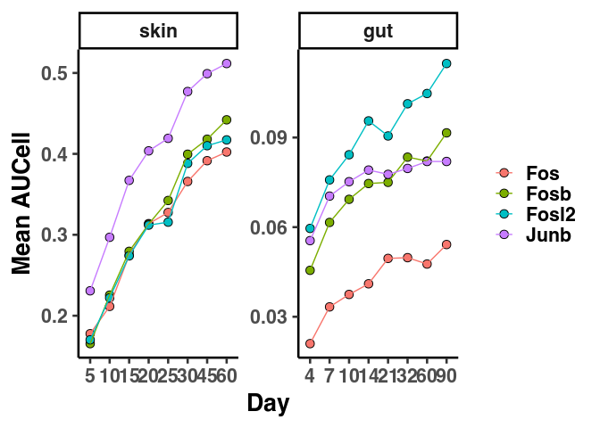
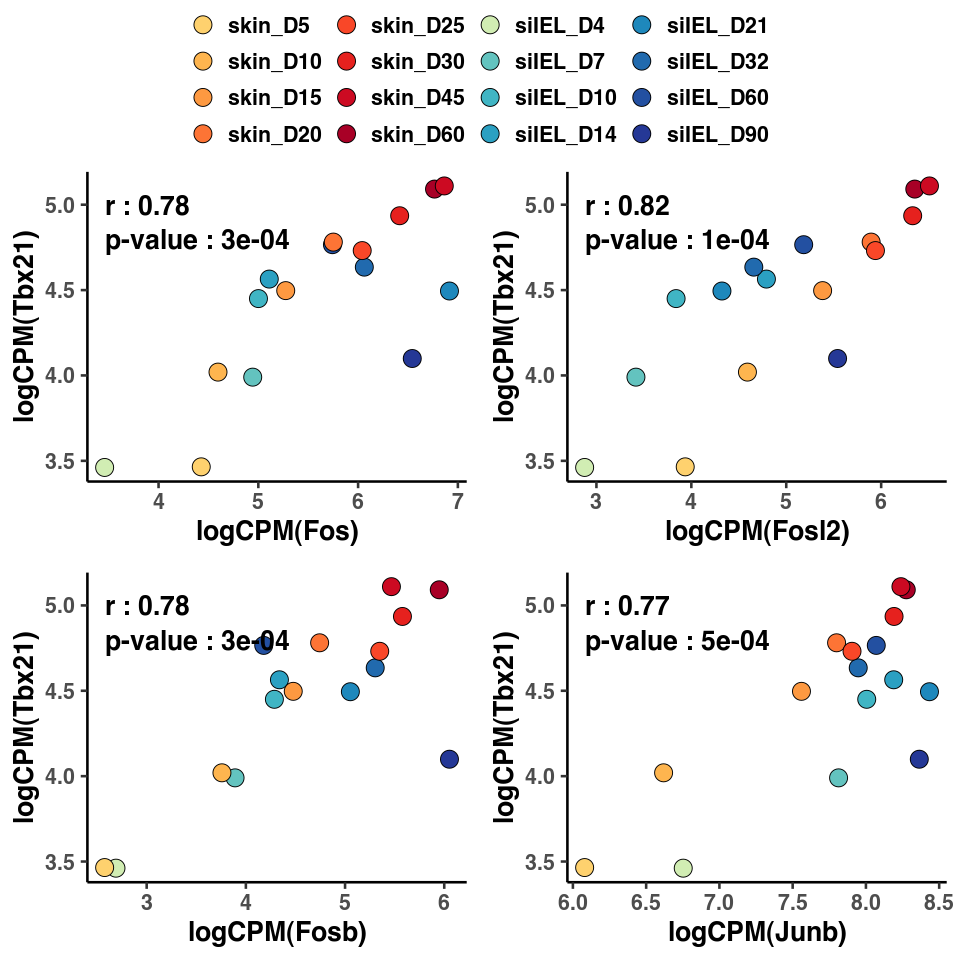
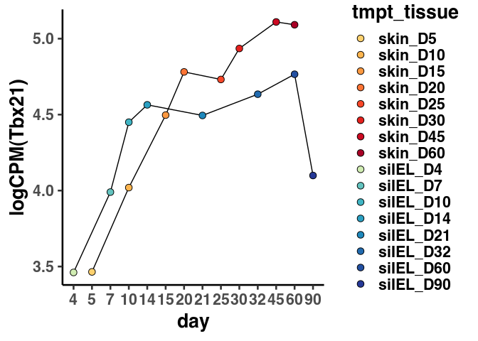
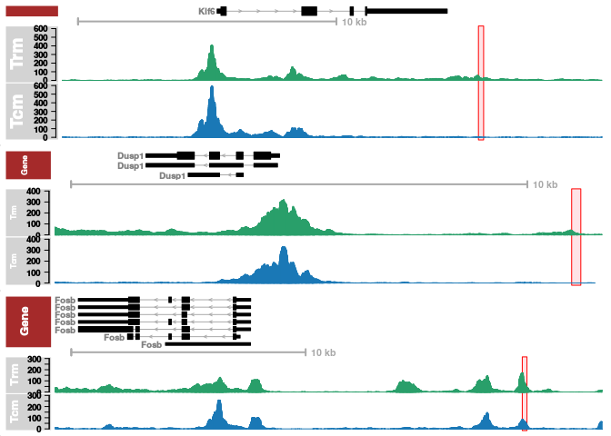

Figure 4
================

``` r
library(reticulate)
library(gtools)
library(tidyverse)
library(ggplot2)
library(DESeq2)
library(glue)
library(magrittr)
library(VennDiagram)
library(ComplexHeatmap)
library(circlize)
library(ggpubr)
library(ggrepel)
library(UpSetR)
library(affy)
library(mogene10sttranscriptcluster.db)
library(GenomicAlignments)
library(Rsamtools)
library(magrittr)
library(Gviz)
data(geneModels)
library(org.Mm.eg.db)
library(Organism.dplyr)
library(GenomicFeatures)
library(TxDb.Mmusculus.UCSC.mm10.knownGene)

use_python("/projects/home/nealpsmith/.conda/envs/old_peg_github/bin/python")

godsnot_102 = c(
  # "#FFFF00", Yellow isn't great
  #"#1CE6FF", # This one is kinda ugly too
  "#FF34FF", "#FF4A46", "#008941", "#006FA6", "#A30059",
  "#FFDBE5", "#7A4900", "#0000A6", "#63FFAC", "#B79762", "#004D43", "#8FB0FF", "#997D87",
  "#5A0007", "#809693", "#6A3A4C", "#1B4400", "#4FC601", "#3B5DFF", "#4A3B53", "#FF2F80",
  "#61615A", "#BA0900", "#6B7900", "#00C2A0", "#FFAA92", "#FF90C9", "#B903AA", "#D16100",
  "#DDEFFF", "#000035", "#7B4F4B", "#A1C299", "#300018", "#0AA6D8", "#013349", "#00846F",
  "#372101", "#FFB500", "#C2FFED", "#A079BF", "#CC0744", "#C0B9B2", "#C2FF99", "#001E09",
  "#00489C", "#6F0062", "#0CBD66", "#EEC3FF", "#456D75", "#B77B68", "#7A87A1", "#788D66",
  "#885578", "#FAD09F", "#FF8A9A", "#D157A0", "#BEC459", "#456648", "#0086ED", "#886F4C",
  "#34362D", "#B4A8BD", "#00A6AA", "#452C2C", "#636375", "#A3C8C9", "#FF913F", "#938A81",
  "#575329", "#00FECF", "#B05B6F", "#8CD0FF", "#3B9700", "#04F757", "#C8A1A1", "#1E6E00",
  "#7900D7", "#A77500", "#6367A9", "#A05837", "#6B002C", "#772600", "#D790FF", "#9B9700",
  "#549E79", "#FFF69F", "#201625", "#72418F", "#BC23FF", "#99ADC0", "#3A2465", "#922329",
  "#5B4534", "#FDE8DC", "#404E55", "#0089A3", "#CB7E98", "#A4E804", "#324E72"
)
```

``` python
import getpass
import pegasus as pg
```

    ## WARNING:param.Parameterized: Use method 'warning' via param namespace 
    ## WARNING:param.main: pandas could not register all extension types imports failed with the following error: cannot import name 'ABCIndexClass' from 'pandas.core.dtypes.generic' (/projects/home/nealpsmith/.conda/envs/old_peg_github/lib/python3.7/site-packages/pandas/core/dtypes/generic.py)

``` python
import scanpy as sc
import os
import matplotlib.pyplot as plt
import pandas as pd
import numpy as np
import anndata
import math
import seaborn as sns
import matplotlib.colors as clr
from pylab import cm
import matplotlib as mpl
from matplotlib.lines import Line2D
from mpl_toolkits.axes_grid1 import make_axes_locatable
from scipy.sparse import csr_matrix
from collections import Counter
from cmcrameri import cm as cmc

mpl.rcParams['axes.spines.right'] = False
mpl.rcParams['axes.spines.top'] = False
# mpl.rcParams['pdf.fonttype'] = 42

# Set a colormap
gene_colormap = clr.LinearSegmentedColormap.from_list('gene_cmap', ["#e0e0e1", '#4576b8', '#02024a'], N=200)

# Set a switcher up so the script will run on any computer
def file_path(user = getpass.getuser()):
    switcher = {
            "nealp": "C:/Users/nealp/Documents/Dropbox (Partners HealthCare)/Chloe&Mazen/Collaborator_projects/Kupper_TRM/neal_analysis",
            "neal": "/home/neal/Documents/Dropbox (Partners HealthCare)/Chloe&Mazen/Collaborator_projects/Kupper_TRM/neal_analysis",
            "nealpsmith": "/projects/home/nealpsmith/projects/kupper"

    }
    if switcher.get(user):
        return(switcher.get(user))
    else :
        print("Add your local filepath to the switcher! run getpass.getuser() to get your ID")
```

``` r
# ### First the siIEL ###
gut1_aucell <- read.csv('/projects/home/nealpsmith/projects/kupper/pyscenic/res/gut1/gut1.auc_with_timepoint.csv', row.names = 1)
colnames(gut1_aucell) <- sapply(colnames(gut1_aucell), function(x) sub("...", "", x, fixed = TRUE))
gut1_aucell$day <- paste("d", gut1_aucell$day, sep = "")
gut_day_int <- list("d4" = 0, "d7" = 1, "d10" = 2, "d14" = 3, "d21" = 4, "d32" = 5, "d60" = 6, "d90" = 7)

# Filter to just regulons that meet criteria
gut1_regulon_genes <-read.csv("/projects/home/nealpsmith/projects/kupper/kurd_paper/data/pyscenic/gut1/gut1_regulon_genes.csv",
                            row.names = 1)
gut_keep <- intersect(colnames(gut1_regulon_genes), colnames(gut1_aucell))
gut1_aucell <- gut1_aucell[,c(gut_keep, "day")]

gut1_aucell$day_int <- sapply(gut1_aucell$day, function(x) gut_day_int[[x]])

mean_auc_gut <- gut1_aucell %>%
  reshape2::melt(id.vars = c("day", "day_int")) %>%
  group_by(day, day_int, variable) %>%
  summarise(mean_aucell = mean(value)) %>%
  mutate(tissue = "gut")

# Use lienar model to calculate p-values
lm_gut <- lapply(unique(mean_auc_gut$variable), function(reg){
  reg_df <- mean_auc_gut %>%
    dplyr::filter(variable == reg)
  lin_model <- summary(lm(mean_aucell ~ day_int, data = reg_df))
  stat_info <- data.frame(regulon = reg,
                          gut_r_squared = lin_model$r.squared,
                          gut_p_val = as.numeric(lin_model$coefficients[,4][2]),
                          gut_slope = as.numeric(lin_model$coefficients[,1][2]))


  return(stat_info)
}) %>%
  do.call(rbind, .)

lm_gut$gut_adj_pval <- p.adjust(lm_gut$gut_p_val, method = "fdr")

### Now the Skin ###
skin1_aucell <- read.csv('/projects/home/nealpsmith/projects/kupper/pyscenic/res/skin1/skin1.auc_with_timepoint.csv', row.names = 1)
colnames(skin1_aucell) <- sapply(colnames(skin1_aucell), function(x) sub("...", "", x, fixed = TRUE))
skin1_aucell$day <- paste("d", skin1_aucell$day, sep = "")
skin_day_int <- list("d5" = 0, "d10" = 1, "d15" = 2, "d20" = 3, "d25" = 4, "d30" = 5, "d45" = 6, "d60" = 7)

skin1_regulon_genes <- read.csv("/projects/home/nealpsmith/projects/kupper/all_data_analysis/data/integrated/pyscenic/skin1/skin1_regulon_genes.csv",
                            row.names = 1)
skin_keep <- intersect(colnames(skin1_regulon_genes), colnames(skin1_aucell))
skin1_aucell <- skin1_aucell[,c(skin_keep, "day")]

skin1_aucell$day_int <- sapply(skin1_aucell$day, function(x) skin_day_int[[x]])

mean_auc_skin <- skin1_aucell %>%
  reshape2::melt(id.vars = c("day", "day_int")) %>%
  group_by(day, day_int, variable) %>%
  summarise(mean_aucell = mean(value)) %>%
  mutate(tissue = "skin")

# Use lienar model to calculate p-values
lm_skin <- lapply(unique(mean_auc_skin$variable), function(reg){
  reg_df <- mean_auc_skin %>%
    dplyr::filter(variable == reg)
  lin_model <- summary(lm(mean_aucell ~ day_int, data = reg_df))
  stat_info <- data.frame(regulon = reg,
                          skin_r_squared = lin_model$r.squared,
                          skin_p_val = as.numeric(lin_model$coefficients[,4][2]),
                          skin_slope = as.numeric(lin_model$coefficients[,1][2]))
  return(stat_info)
}) %>%
  do.call(rbind, .)

lm_skin$skin_adj_pval <- p.adjust(lm_skin$skin_p_val, method = "fdr")

all_mean_auc <- rbind(mean_auc_skin, mean_auc_gut)
genes_oi <- c("Fos", "Fosb", "Fosl2", "Junb")

plot_df <- all_mean_auc[all_mean_auc$variable %in% genes_oi,]
plot_df$timepoint <- sapply(plot_df$day, function(x) as.numeric(sub("d", "", x)))
plot_df$timepoint <- factor(plot_df$timepoint)
plot_df$tissue <- factor(plot_df$tissue, levels = c("skin", "gut"))
ggplot(plot_df, aes(x = timepoint, y = mean_aucell, fill = variable, group = variable)) +
  geom_point(pch = 21, size = 3) +
  geom_line(aes(color = variable)) +
  facet_wrap(~tissue, scales = "free") +
  xlab("Day") + ylab("Mean AUCell") +
  theme_classic(base_size = 20) +
  theme(legend.title=element_blank())
```

<!-- -->

``` python

cmap = cm.get_cmap('YlGnBu', 140)    # PiYG
hex_list = []
for i in range(cmap.N):
    rgba = cmap(i)
    # rgb2hex accepts rgb or rgba
    hex_list.append(mpl.colors.rgb2hex(rgba))

colors = [c for n, c in enumerate(hex_list) if n%10 == 0]
colors = colors [1:13] # First one is too dim
days = ["0", "3", "4", "5", "6", "7", "10", "14", "21", "32", "60", "90"]

day_col_dict = dict(zip(days, colors))
# Also make as a colormap
kurd_day_cmap = clr.LinearSegmentedColormap.from_list('day_cmap', colors, N=len(colors))

cmap = cm.get_cmap('YlOrRd', 110)    # PiYG
hex_list = []
for i in range(cmap.N):
    rgba = cmap(i)
    # rgb2hex accepts rgb or rgba
    hex_list.append(mpl.colors.rgb2hex(rgba))

colors = [c for n, c in enumerate(hex_list) if n%10 == 0]
colors = colors [1:11] # First one is too dim
days = ["0", "2", "5", "10", "15", "20", "25", "30", "45", "60"]

day_col_dict = dict(zip(days, colors))
kupper_day_cmap = clr.LinearSegmentedColormap.from_list('day_cmap', colors, N=len(colors))

# Make a gene colormap too
gene_colormap = clr.LinearSegmentedColormap.from_list('gene_cmap', ["#d3d3d3", '#482cc7'], N=200)

gut1_data = pg.read_input(os.path.join(file_path(), "kurd_paper", "data", "gut1_data_subcluster.h5ad"))
```

    ## 2024-08-30 13:15:12,206 - pegasus - INFO - Time spent on 'read_input' = 3.61s.

``` python
skin1_data = pg.read_input(os.path.join(file_path(), "all_data_analysis", "data", "integrated", "skin1_subcluster.h5ad"))
```

    ## 2024-08-30 13:15:13,743 - pegasus - INFO - Time spent on 'read_input' = 1.53s.

``` python
skin1_data.obs["day"] = [int(d) for d in skin1_data.obs["day"]]
data_dict = {"skin" : skin1_data, "siIEL" : gut1_data}
day_cmaps = {"skin": kupper_day_cmap, "siIEL" : kurd_day_cmap}
```

``` python

## Look at biological categories of genes ###
# The human hypoxia signature from mSigDB
hypoxia_human = ["ACKR3", "ADM", "ADORA2B", "AK4", "AKAP12", "ALDOA", "ALDOB", "ALDOC", "AMPD3", "ANGPTL4",
                 "ANKZF1", "ANXA2", "ATF3", "ATP7A", "B3GALT6", "B4GALNT2", "BCAN", "BCL2", "BGN", "BHLHE40",
                 "BNIP3L", "BRS3", "BTG1", "CA12", "CASP6", "CAV1", "CAVIN1", "CAVIN3", "CCN1", "CCN2", "CCN5",
                 "CCNG2", "CDKN1A", "CDKN1B", "CDKN1C", "CHST2", "CHST3", "CITED2", "COL5A1", "CP", "CSRP2",
                 "CXCR4", "DCN", "DDIT3", "DDIT4", "DPYSL4", "DTNA", "DUSP1", "EDN2", "EFNA1", "EFNA3", "EGFR",
                 "ENO1", "ENO2", "ENO3", "ERO1A", "ERRFI1", "ETS1", "EXT1", "F3", "FAM162A", "FBP1", "FOS",
                 "FOSL2", "FOXO3", "GAA", "GALK1", "GAPDH", "GAPDHS", "GBE1", "GCK", "GCNT2", "GLRX", "GPC1",
                 "GPC3", "GPC4", "GPI", "GRHPR", "GYS1", "HAS1", "HDLBP", "HEXA", "HK1", "HK2", "HMOX1",
                 "HOXB9", "HS3ST1", "HSPA5", "IDS", "IER3", "IGFBP1", "IGFBP3", "IL6", "ILVBL", "INHA", "IRS2",
                 "ISG20", "JMJD6", "JUN", "KDELR3", "KDM3A", "KIF5A", "KLF6", "KLF7", "KLHL24", "LALBA", "LARGE1",
                 "LDHA", "LDHC", "LOX", "LXN", "MAFF", "MAP3K1", "MIF", "MT1E", "MT2A", "MXI1", "MYH9", "NAGK", "NCAN",
                 "NDRG1", "NDST1", "NDST2", "NEDD4L", "NFIL3", "NOCT", "NR3C1", "P4HA1", "P4HA2", "PAM", "PCK1",
                 "PDGFB", "PDK1", "PDK3", "PFKFB3", "PFKL", "PFKP", "PGAM2", "PGF", "PGK1", "PGM1", "PGM2", "PHKG1",
                 "PIM1", "PKLR", "PKP1", "PLAC8", "PLAUR", "PLIN2", "PNRC1", "PPARGC1A", "PPFIA4", "PPP1R15A",
                 "PPP1R3C", "PRDX5", "PRKCA", "PYGM", "RBPJ", "RORA", "RRAGD", "S100A4", "SAP30", "SCARB1", "SDC2",
                 "SDC3", "SDC4", "SELENBP1", "SERPINE1", "SIAH2", "SLC25A1", "SLC2A1", "SLC2A3", "SLC2A5", "SLC37A4",
                 "SLC6A6", "SRPX", "STBD1", "STC1", "STC2", "SULT2B1", "TES", "TGFB3", "TGFBI", "TGM2", "TIPARP",
                 "TKTL1", "TMEM45A", "TNFAIP3", "TPBG", "TPD52", "TPI1", "TPST2", "UGP2", "VEGFA", "VHL", "VLDLR",
                 "WSB1", "XPNPEP1", "ZFP36", "ZNF292"]

mouse_to_human = pd.read_csv("/projects/home/nealpsmith/data/useful/human_to_mouse_genes.csv")
filt = mouse_to_human[mouse_to_human["HGNC.symbol"].isin(hypoxia_human)]
mouse_hypoxia = list(filt["MGI.symbol"])


gene_cats = {"immediate_early_genes" : ["Fos", "Fosb", "Fosl2", "Gem", "Junb", "Zfp36l1", "Nr4a2", "Nr4a1",
                                                  "Dennd4a", "Ifrd1", "Rel", "Nr4a3", "Egr1", "Dusp1"],
             "hypoxia" : mouse_hypoxia}

pg.calc_signature_score(gut1_data, signatures=gene_cats, n_bins = 2)
```

    ## 2024-08-30 13:15:17,127 - pegasus - WARNING - For signature hypoxia, genes 'Dtna', 'Selenbp2', 'Cav1', 'Ppp1r3c', 'Tmem45a', 'Brs3', 'Lox', 'Ccn1', 'Has1', 'Ero1a', 'Ackr3', 'Tesl1', 'Tesl2', 'Srpx', 'Ccn2', 'Ccn5', 'Igfbp1' are not in the data and thus omitted!
    ## 2024-08-30 13:15:17,279 - pegasus - INFO - Time spent on 'calc_signature_score' = 0.85s.

``` python
pg.calc_signature_score(skin1_data, signatures=gene_cats, n_bins = 2)
```

    ## 2024-08-30 13:15:17,539 - pegasus - WARNING - For signature hypoxia, genes 'Brs3', 'Ccn1', 'Ero1a', 'Tesl1', 'Tesl2', 'Ccn2', 'Pklr', 'Ccn5', 'Igfbp1' are not in the data and thus omitted!
    ## 2024-08-30 13:15:17,604 - pegasus - INFO - Time spent on 'calc_signature_score' = 0.32s.

``` python
data_dict = {"skin" : skin1_data, "siIEL" : gut1_data}

fig, ax = plt.subplots(nrows=2, ncols=2, figsize=(10, 10))
ax = ax.ravel()
num = 0
for tissue in data_dict.keys():
    for name in gene_cats.keys() :
        print(num)
        dat = data_dict[tissue]
        plot_df = pd.DataFrame(dat.obs[name], columns=[name], index=dat.obs_names)
        plot_df["x"] = dat.obsm["X_umap"][:, 0]
        plot_df["y"] = dat.obsm["X_umap"][:, 1]
        vmin = np.min(plot_df[name])
        vmax = np.max(plot_df[name])
        norm = clr.TwoSlopeNorm(vmin=vmin, vcenter=0, vmax=vmax)
        hb = ax[num].hexbin(plot_df["x"], plot_df["y"], C=plot_df[name], cmap=cmc.vik, norm = norm, gridsize=100, edgecolors = "none")
        cb = fig.colorbar(hb, ax=ax[num], aspect=10, shrink = 0.35, ticks = [round(vmin + 0.5), 0, round(vmax - 0.5)])
        ax[num].get_xaxis().set_ticks([])
        ax[num].get_yaxis().set_ticks([])
        ax[num].spines['top'].set_visible(False)
        ax[num].spines['right'].set_visible(False)
        ax[num].set_xlabel("UMAP1")
        ax[num].set_ylabel("UMAP2")
        ax[num].set_title(name.replace("_", " "), size=25)
        fig.tight_layout()
        num +=1
fig
```


``` r
# # Load in the counts and metadata
count_data_kupper <- read.csv("/projects/home/nealpsmith/projects/kupper/all_data_analysis/data/integrated/skin1_subcluster_pseudobulk_on_time_counts.csv", row.names = 1)

count_data_kurd <- read.csv("/projects/home/nealpsmith/projects/kupper/kurd_paper/data/gut1_data_subcluster_pseudobulk_on_time_counts.csv",
                     row.names = 1)

# Now need to log-norm
norm_res_kupper <- apply(count_data_kupper, 2, function(c){
  n_total <- sum(c)
  per_100k <- (c * 1000000) / n_total
  return(per_100k)
})

norm_res_kupper <- log1p(norm_res_kupper)
# To be consistent with the DEGs, removing the second D30 sample, but doesn't really matter. Follows the same pattern

norm_res_kupper <- norm_res_kupper[,colnames(norm_res_kupper) != "samp_19_D30_Skin_30"]


# Can we change the column names to just be timepoints?
colnames(norm_res_kupper) <- sapply(colnames(norm_res_kupper), function(x) strsplit(x, "_")[[1]][3])

norm_res_kurd <- apply(count_data_kurd, 2, function(c){
  n_total <- sum(c)
  per_100k <- (c * 1000000) / n_total
  return(per_100k)
})
norm_res_kurd <- log1p(norm_res_kurd)

# Get the average of the repeated timepoints
colname_to_tmpt <- lapply(colnames(norm_res_kurd), function(x) paste("D", tail(strsplit(x, "_")[[1]], n = 1), sep = ""))
tmpts <- unique(sapply(colnames(norm_res_kurd), function(x) tail(strsplit(x, "_")[[1]], n = 1)))

norm_res_kurd <- lapply(tmpts, function(tpt){
  cols = as.data.frame(norm_res_kurd[,grepl(glue("*_{tpt}$"), colnames(norm_res_kurd))])
  if(ncol(cols) > 1){
   mean = rowMeans(cols) %>%
    as.data.frame() %>%
    `colnames<-`(glue("D{tpt}")) %>%
     rownames_to_column("gene")
  return(mean)
  } else {
    cols <- cols %>%
      `colnames<-`(glue("D{tpt}")) %>%
     rownames_to_column("gene")
    return(cols)
  }
}) %>%
  purrr::reduce(left_join, by = "gene") %>%
  column_to_rownames("gene")


# Now make the day annotation
day_colors = c('skin_D0'= '#fff2ac',
               'skin_D2'= '#ffe48c',
               'skin_D5'= '#fed16e',
               'skin_D10'= '#feb54f',
               'skin_D15'= '#fd9941',
               'skin_D20'= '#fd7435',
               'skin_D25'= '#f94728',
               'skin_D30'= '#e6211e',
               'skin_D45'= '#cc0a22',
               'skin_D60'= '#a80026',
               'siIEL_D0'= '#f5fbc2',
               'siIEL_D3'= '#e7f6b1',
               'siIEL_D4'= '#d1edb3',
               'siIEL_D5'= '#b1e1b6',
               'siIEL_D6'= '#88d0ba',
               'siIEL_D7'= '#63c3bf',
               'siIEL_D10'= '#40b5c4',
               'siIEL_D14'= '#2ba0c2',
               'siIEL_D21'= '#1e88bc',
               'siIEL_D32'= '#216aae',
               'siIEL_D60'= '#2350a1',
               'siIEL_D90'= '#253896')

# Fos genes
genes_oi <- c("Fos", "Fosl2", "Fosb")

gene_pairs <- data.frame("gene1" = rep("Itgae", length(genes_oi)),
                         "gene2" = genes_oi)
plot_list <- list()
for (i in 1:nrow(gene_pairs)){
  g1 <- gene_pairs[i, "gene1"]
  g2 <- gene_pairs[i, "gene2"]

  plot_info_kupper <- norm_res_kupper[c(g1, g2),] %>%
    t() %>%
    as.data.frame() %>%
    rownames_to_column(var = "tmpt") %>%
    mutate(tmpt_tissue = paste("skin", tmpt, sep = "_"))

  plot_info_kurd <- norm_res_kurd[c(g1, g2),] %>%
    t() %>%
    as.data.frame() %>%
    rownames_to_column(var = "tmpt") %>%
    mutate(tmpt_tissue = paste("siIEL", tmpt, sep = "_"))

  plot_df <- rbind(plot_info_kupper, plot_info_kurd)

  plot_df$tmpt_tissue <- factor(plot_df$tmpt_tissue, levels = names(day_colors))

  p <- ggplot(plot_df, aes_string(x = g1, y = g2, fill = "tmpt_tissue")) +
    geom_point(pch = 21, size = 5) +
    scale_fill_manual(values = day_colors) +
    xlab(glue("Log(CPM) : {g1}")) +
    ylab(glue("Log(CPM) : {g2}")) +
    # ggtitle(glue("{g2} vs. {g1}")) +
    theme_classic(base_size = 20)
  plot_df$tmpt_int <- sapply(plot_df$tmpt, function(x) as.numeric(sub("D", "", x)))
  plot_df$tissue <- sapply(as.character(plot_df$tmpt_tissue), function(x) strsplit(x, "_")[[1]][1])
  plot_df$tmpt_int <- factor(plot_df$tmpt_int)

  plot_list <- c(plot_list, list(p))
}
plots <- ggarrange(plotlist = plot_list, common.legend = TRUE, ncol = 3)
plots
```

<!-- -->

``` r
plot_list <- list()
for (gene_oi in c("Fos", "Fosl2", "Fosb", "Junb")){
  plot_info_kurd <- norm_res_kurd[c("Tbx21", gene_oi),] %>%
    t() %>%
    as.data.frame() %>%
    rownames_to_column(var = "tmpt") %>%
    mutate(tmpt_tissue = paste("siIEL", tmpt, sep = "_"))

  plot_info_kurd$tmpt_tissue <- factor(plot_info_kurd$tmpt_tissue, levels = names(day_colors))

  plot_info_kupper <- norm_res_kupper[c("Tbx21", gene_oi),] %>%
    t() %>%
    as.data.frame() %>%
    # `colnames<-`(c("Tbx21")) %>%
    rownames_to_column(var = "tmpt") %>%
    mutate(tmpt_tissue = paste("skin", tmpt, sep = "_"))

  plot_info_kupper$tmpt_tissue <- factor(plot_info_kupper$tmpt_tissue, levels = names(day_colors))

  all_plot_info <- rbind(plot_info_kurd, plot_info_kupper)
  all_plot_info$tissue <- sapply(as.character(all_plot_info$tmpt_tissue), function(x) strsplit(x, "_")[[1]][1])
  all_plot_info$day <- sapply(as.character(all_plot_info$tmpt_tissue), function(x) as.numeric(sub("D", "", strsplit(x, "_")[[1]][2])))
  all_plot_info$day <- factor(all_plot_info$day)
  cor_res <- cor.test(all_plot_info[[gene_oi]], all_plot_info$Tbx21,  method = "pearson")
  r = round(cor_res$estimate, 2)
  pval <- round(cor_res$p.value, 4)

  p <- ggplot(all_plot_info, aes_string(x = gene_oi, y = "Tbx21", fill = "tmpt_tissue", group = "tissue")) +
    # geom_line() +
    geom_point(pch = 21, size = 6) +
    scale_fill_manual(values = day_colors) +
    xlab(glue("logCPM({gene_oi})")) +
    ylab("logCPM(Tbx21)") +
    annotate(geom = "text", x =  min(all_plot_info[[gene_oi]]), y = 5,
             label = glue("r : {r}"), size = 7, hjust= 0) +
    annotate(geom = "text", x =  min(all_plot_info[[gene_oi]]), y = 4.8,
             label = glue("p-value : {pval}"), size = 7, hjust = 0) +
    theme_classic(base_size = 20) +
    theme(legend.title = element_blank())
  plot_list <- c(plot_list, list(p))
}

ggarrange(plotlist = plot_list, nrow = 2, ncol = 2, common.legend = TRUE)
```

<!-- -->

``` r
day_colors = c('skin_D0'= '#fff2ac',
               'skin_D2'= '#ffe48c',
               'skin_D5'= '#fed16e',
               'skin_D10'= '#feb54f',
               'skin_D15'= '#fd9941',
               'skin_D20'= '#fd7435',
               'skin_D25'= '#f94728',
               'skin_D30'= '#e6211e',
               'skin_D45'= '#cc0a22',
               'skin_D60'= '#a80026',
               'siIEL_D0'= '#f5fbc2',
               'siIEL_D3'= '#e7f6b1',
               'siIEL_D4'= '#d1edb3',
               'siIEL_D5'= '#b1e1b6',
               'siIEL_D6'= '#88d0ba',
               'siIEL_D7'= '#63c3bf',
               'siIEL_D10'= '#40b5c4',
               'siIEL_D14'= '#2ba0c2',
               'siIEL_D21'= '#1e88bc',
               'siIEL_D32'= '#216aae',
               'siIEL_D60'= '#2350a1',
               'siIEL_D90'= '#253896')
count_data <- read.csv("/projects/home/nealpsmith/projects/kupper/all_data_analysis/data/integrated/skin1_subcluster_pseudobulk_on_time_counts.csv",
                       row.names = 1)

count_data <- count_data %>%
  dplyr::select(-c("samp_19_D30_Skin_30"))

# Now need to log-norm
norm_res_kupper <- apply(count_data, 2, function(c){
  n_total <- sum(c)
  per_100k <- (c * 1000000) / n_total
  return(per_100k)
})

norm_res_kupper <- log1p(norm_res_kupper)

# Can we change the column names to just be timepoints?
colnames(norm_res_kupper) <- sapply(colnames(norm_res_kupper), function(x) strsplit(x, "_")[[1]][3])


# Now need to make the Kurd one
count_data <- read.csv("/projects/home/nealpsmith/projects/kupper/kurd_paper/data/gut1_data_subcluster_pseudobulk_on_time_counts.csv",
                       row.names = 1)

# Now need to log-norm
norm_res_kurd <- apply(count_data, 2, function(c){
  n_total <- sum(c)
  per_100k <- (c * 1000000) / n_total
  return(per_100k)
})

norm_res_kurd <- log1p(norm_res_kurd)

# Get the average of the repeated timepoints
colname_to_tmpt <- lapply(colnames(norm_res_kurd), function(x) paste("D", tail(strsplit(x, "_")[[1]], n = 1), sep = ""))
tmpts <- unique(sapply(colnames(norm_res_kurd), function(x) tail(strsplit(x, "_")[[1]], n = 1)))

norm_res_kurd <- lapply(tmpts, function(tpt){
  cols = as.data.frame(norm_res_kurd[,grepl(glue("*_{tpt}$"), colnames(norm_res_kurd))])
  if(ncol(cols) > 1){
   mean = rowMeans(cols) %>%
    as.data.frame() %>%
    `colnames<-`(glue("D{tpt}")) %>%
     rownames_to_column("gene")
  return(mean)
  } else {
    cols <- cols %>%
      `colnames<-`(glue("D{tpt}")) %>%
     rownames_to_column("gene")
    return(cols)
  }
}) %>%
  purrr::reduce(left_join, by = "gene") %>%
  column_to_rownames("gene")

plot_info_kurd <- norm_res_kurd[c("Tbx21"),] %>%
    t() %>%
    as.data.frame() %>%
    rownames_to_column(var = "tmpt") %>%
    mutate(tmpt_tissue = paste("siIEL", tmpt, sep = "_"))

plot_info_kurd$tmpt_tissue <- factor(plot_info_kurd$tmpt_tissue, levels = names(day_colors))

plot_info_kupper <- norm_res_kupper[c("Tbx21"),] %>%
  as.data.frame() %>%
  `colnames<-`(c("Tbx21")) %>%
  rownames_to_column(var = "tmpt") %>%
  mutate(tmpt_tissue = paste("skin", tmpt, sep = "_"))

plot_info_kupper$tmpt_tissue <- factor(plot_info_kupper$tmpt_tissue, levels = names(day_colors))

all_plot_info <- rbind(plot_info_kurd, plot_info_kupper)
all_plot_info$tissue <- sapply(as.character(all_plot_info$tmpt_tissue), function(x) strsplit(x, "_")[[1]][1])
all_plot_info$day <- sapply(as.character(all_plot_info$tmpt_tissue), function(x) as.numeric(sub("D", "", strsplit(x, "_")[[1]][2])))
all_plot_info$day <- factor(all_plot_info$day)

ggplot(all_plot_info, aes(x = day, y = Tbx21, fill = tmpt_tissue, group = tissue)) +
  geom_line() +
  geom_point(pch = 21, size = 3) +
  scale_fill_manual(values = day_colors) +
  ylab("logCPM(Tbx21)") +
  # scale_y_continuous(limits = c(3, 6)) +
  theme_classic(base_size = 20)
```

<!-- -->

``` r
scheme <- getScheme()
scheme$GeneRegionTrack$fill <- "black"
scheme$GeneRegionTrack$col <- NULL
scheme$GeneRegionTrack$transcriptAnnotation <- "transcript"
scheme$DataTrack$col.boxplotFrame="black"
scheme$DataTrack$fontcolor.legend = "black"
scheme$GdObject$fill = "white"
addScheme(scheme, "myScheme")
options(Gviz.scheme = "myScheme")

TxDb <-TxDb.Mmusculus.UCSC.mm10.knownGene
mm10_info <- genes(TxDb)
```

    ##   66 genes were dropped because they have exons located on both strands
    ##   of the same reference sequence or on more than one reference sequence,
    ##   so cannot be represented by a single genomic range.
    ##   Use 'single.strand.genes.only=FALSE' to get all the genes in a
    ##   GRangesList object, or use suppressMessages() to suppress this message.

``` r
mm10_info <- as.data.frame(mm10_info)
gene_number_to_mgi <- read.csv("/projects/home/nealpsmith/data/useful/mgi_gene_number_to_symbol.tsv", sep = "\t")
gene_number_to_mgi$NCBI.GeneID <- as.character(gene_number_to_mgi$NCBI.GeneID)

mm10_info %<>%
  dplyr::left_join(gene_number_to_mgi, by = c("gene_id" = "NCBI.GeneID"))
colnames(mm10_info) <- c("chromosome", "start", "end", "width", "strand", "gene_id", "symbol", "description", "Taxonomic.Name", "feature", "transcripts",
                        "Gene.Group.Identifier", "Gene.Group.Method")


txdb <- makeTxDbFromGFF("/projects/home/nealpsmith/projects/kupper/atac_seq/data/gff_file/gencode.vM10.annotation.gff3")
```

    ## Import genomic features from the file as a GRanges object ...

    ## OK

    ## Prepare the 'metadata' data frame ... OK
    ## Make the TxDb object ...

    ## Warning in .get_cds_IDX(mcols0$type, mcols0$phase): The "phase" metadata column contains non-NA values for features of type
    ##   stop_codon. This information was ignored.

    ## OK

``` r
# First want to get genes to look at based on regulons
regulon_gene_df <- read.csv("/projects/home/nealpsmith/projects/kupper/all_data_analysis/data/integrated/pyscenic/skin1/skin1_regulon_genes.csv",
                            row.names = 1)

# Get the Trm signature
# Lets look at the overlap with the "core signature" we have from skin + gut
skin_de <- read.csv("/projects/home/nealpsmith/projects/kupper/all_data_analysis/data/integrated/pseudobulk/lin_modelling_subclusters/skin1_by_day_padj_0.1_fc_0.2_perc_5.csv",
                    row.names = 1)

gut_de <- read.csv("/projects/home/nealpsmith/projects/kupper/kurd_paper/data/pseudobulk/lin_modelling_subclusters/gut1_by_day_padj_0.1_fc_0.2_perc_5.csv",
                   row.names = 1)

# memory first
skin_mem <- skin_de[skin_de$log2FoldChange > 0,]
gut_mem <- gut_de[gut_de$log2FoldChange > 0,]

skin_genes <- skin_mem$gene
gut_genes <- gut_mem$gene
kupper_trm <- intersect(skin_genes, gut_genes)


intersect_genes <- intersect(regulon_gene_df$Fos, kupper_trm)


intersect_genes <- unique(c(intersect(regulon_gene_df$Fos, kupper_trm), intersect(regulon_gene_df$Junb, kupper_trm)))


# Fos info
fos_motifs <- read.csv("/projects/home/nealpsmith/projects/kupper/atac_seq/data/homer/fos_motifs_in_trm/fos_results.txt",
                       sep = "\t")
colnames(fos_motifs)[1] <- "PositionID"
enriched_fos_motifs <- read.csv("/projects/home/nealpsmith/projects/kupper/atac_seq/data/homer/fos_motifs_in_trm/fos_results_with_findMotifsGenome.txt",
                                sep = "\t")
fos_motifs %<>%
  dplyr::filter(PositionID %in% enriched_fos_motifs$PositionID)

fos_tss_locs <- lapply(intersect_genes, function(g){
  loc <- fos_motifs %>%
    dplyr::filter(Gene.Name == g,  Distance.to.TSS < 20000, Distance.to.TSS > -20000) %>%
    # dplyr::filter(grepl("promoter", Annotation)) %>%
    dplyr::select(Chr, Start, End, Gene.Name, Distance.to.TSS)
  # The end location is the same as the start...lets add 12 bases
  # loc$End <- loc$End + 10
  return(loc)
}) %>%
  do.call(rbind, .)

# Need to get the Junb binding motif locations
junb_motifs <- read.csv("/projects/home/nealpsmith/projects/kupper/atac_seq/data/homer/junb_motifs_in_trm/junb_results.txt",
                       sep = "\t")
colnames(junb_motifs)[1] <- "PositionID"
enriched_junb_motifs <- read.csv("/projects/home/nealpsmith/projects/kupper/atac_seq/data/homer/junb_motifs_in_trm/junb_results_with_findMotifsGenome.txt",
                                sep = "\t")
junb_motifs %<>%
  dplyr::filter(PositionID %in% enriched_junb_motifs$PositionID)

junb_tss_locs <- lapply(intersect_genes, function(g){
  loc <- junb_motifs %>%
    dplyr::filter(Gene.Name == g, Distance.to.TSS < 20000, Distance.to.TSS > -20000) %>%
    # dplyr::filter(grepl("promoter", Annotation)) %>%
    dplyr::select(Chr, Start, End, Gene.Name, Distance.to.TSS)
  # The end location is the same as the start...lets add 12 bases
  # loc$End <- loc$End + 10
  return(loc)
}) %>%
  do.call(rbind, .)

all_tss_locs <- rbind(fos_tss_locs, junb_tss_locs) %>% distinct()

gene <- "Klf6"
gene_info <- mm10_info %>%
  dplyr::filter(symbol == gene)


from_klf6 = gene_info$start - 6000
to_klf6 = gene_info$end + 6000
chr_klf6 <- gene_info$chromosome

dist_track_klf6 <- GenomeAxisTrack()

grtrack_klf6 <- GeneRegionTrack(txdb, genome = "mm10", chromosome = chr_klf6, from = from_klf6, to =to_klf6,
                         name = "Gene", background.title = "brown")
symbol(grtrack_klf6) <- mapIds(org.Mm.eg.db,
                            keys=sub("\\.\\d+$", "", gene(grtrack_klf6)),
                            keytype="ENSEMBL", column="SYMBOL")
```

    ## 'select()' returned 1:many mapping between keys and columns

``` r
symbol(grtrack_klf6) <- ifelse(is.na(symbol(grtrack_klf6)), gene(grtrack_klf6), symbol(grtrack_klf6))
grtrack_klf6 <- grtrack_klf6[symbol(grtrack_klf6) == gene]

trm_bam <- "/projects/home/nealpsmith/projects/kupper/atac/bam_files/SA27121_nomito_sorted.bam"
tcm_bam <- "/projects/home/nealpsmith/projects/kupper/atac/bam_files/SA27119_nomito_sorted.bam"

trm_track_klf6 <- DataTrack(trm_bam, name = "Trm", type = "histogram",
                       col.histogram = "#299f6a",
                       col.axis="black", col.name = "#299f6a", ylim = c(0, 600))
tcm_track_klf6 <- DataTrack(tcm_bam, name = "Tcm", type = "histogram",
                       col.histogram = "#1a78b6",
                       col.axis="black", ylim = c(0, 600))
fos_tss_klf6 <- all_tss_locs %>%
  dplyr::filter(Gene.Name == gene) %>%
  .$Start

ht_klf6 <- HighlightTrack(trackList = list(trm_track_klf6, tcm_track_klf6),
                     start = c(fos_tss_klf6), width = 200, chromosome = chr_klf6, col = "red")


gene <- "Dusp1"
gene_info <- mm10_info %>%
  dplyr::filter(symbol == gene)


from_Dusp1 = gene_info$start - 2000
# to = gene_info$end
to_Dusp1 = gene_info$start + 10000
chr_Dusp1 <- gene_info$chromosome

dist_track_Dusp1 <- GenomeAxisTrack()

grtrack_Dusp1 <- GeneRegionTrack(txdb, genome = "mm10", chromosome = chr_Dusp1, from = from_Dusp1, to =to_Dusp1,
                         name = "Gene", background.title = "brown")
symbol(grtrack_Dusp1) <- mapIds(org.Mm.eg.db,
                            keys=sub("\\.\\d+$", "", gene(grtrack_Dusp1)),
                            keytype="ENSEMBL", column="SYMBOL")
```

    ## 'select()' returned 1:many mapping between keys and columns

``` r
symbol(grtrack_Dusp1) <- ifelse(is.na(symbol(grtrack_Dusp1)), gene(grtrack_Dusp1), symbol(grtrack_Dusp1))
grtrack_Dusp1 <- grtrack_Dusp1[symbol(grtrack_Dusp1) == gene]

trm_bam <- "/projects/home/nealpsmith/projects/kupper/atac/bam_files/SA27121_nomito_sorted.bam"
tcm_bam <- "/projects/home/nealpsmith/projects/kupper/atac/bam_files/SA27119_nomito_sorted.bam"

trm_track_Dusp1 <- DataTrack(trm_bam, name = "Trm", type = "histogram",
                       col.histogram = "#299f6a",
                       col.axis="black", col.name = "#299f6a", ylim = c(0, 400))
tcm_track_Dusp1 <- DataTrack(tcm_bam, name = "Tcm", type = "histogram",
                       col.histogram = "#1a78b6",
                       col.axis="black", ylim = c(0, 400))
fos_tss <- all_tss_locs %>%
  dplyr::filter(Gene.Name == gene) %>%
  .$Start

ht_Dusp1 <- HighlightTrack(trackList = list(trm_track_Dusp1, tcm_track_Dusp1),
                     start = c(fos_tss), width = 200, chromosome = chr_Dusp1, col = "red")

gene <- "Fosb"
gene_info <- mm10_info %>%
  dplyr::filter(symbol == "Fosb")


from_Fosb = gene_info$start - 1000
to_Fosb = gene_info$end + 15000
# to = gene_info$start + 10000
chr_Fosb <- gene_info$chromosome

dist_track_Fosb <- GenomeAxisTrack()

grtrack_Fosb <- GeneRegionTrack(txdb, genome = "mm10", chromosome = chr_Fosb, from = from_Fosb, to =to_Fosb,
                         name = "Gene", background.title = "brown")
symbol(grtrack_Fosb) <- mapIds(org.Mm.eg.db,
                            keys=sub("\\.\\d+$", "", gene(grtrack_Fosb)),
                            keytype="ENSEMBL", column="SYMBOL")
```

    ## 'select()' returned 1:many mapping between keys and columns

``` r
symbol(grtrack_Fosb) <- ifelse(is.na(symbol(grtrack_Fosb)), gene(grtrack_Fosb), symbol(grtrack_Fosb))
grtrack_Fosb <- grtrack_Fosb[symbol(grtrack_Fosb) == "Fosb"]

trm_bam <- "/projects/home/nealpsmith/projects/kupper/atac/bam_files/SA27121_nomito_sorted.bam"
tcm_bam <- "/projects/home/nealpsmith/projects/kupper/atac/bam_files/SA27119_nomito_sorted.bam"

trm_track_Fosb <- DataTrack(trm_bam, name = "Trm", type = "histogram",
                       col.histogram = "#299f6a",
                       col.axis="black", col.name = "#299f6a", ylim = c(0, 300))
tcm_track_Fosb <- DataTrack(tcm_bam, name = "Tcm", type = "histogram",
                       col.histogram = "#1a78b6",
                       col.axis="black", ylim = c(0, 300))
fos_tss_Fosb <- all_tss_locs %>%
  dplyr::filter(Gene.Name == "Fosb") %>%
  .$Start

ht_Fosb <- HighlightTrack(trackList = list(trm_track_Fosb, tcm_track_Fosb),
                     start = c(fos_tss_Fosb), width = 200, chromosome = chr_Fosb, col = "red")

grid.newpage()
pushViewport(viewport(layout=grid.layout(3, 1)))
pushViewport(viewport(layout.pos.col=1,layout.pos.row=1))
plotTracks(list(grtrack_klf6,dist_track_klf6, ht_klf6), from = from_klf6, to =to_klf6, transcriptAnnotation="gene_id", scale = 10000, add = TRUE)
# Gviz::plotTracks(list(ideogram, genomeaxis, siteA), add=TRUE)
popViewport(1)
pushViewport(viewport(layout.pos.col=1,layout.pos.row=2))
plotTracks(list(grtrack_Dusp1,dist_track_Dusp1, ht_Dusp1), from = from_Dusp1, to =to_Dusp1, transcriptAnnotation="gene_id", scale = 10000, add = TRUE)
# Gviz::plotTracks(list(ideogram, genomeaxis, siteA), add=TRUE)
popViewport(1)
pushViewport(viewport(layout.pos.col=1,layout.pos.row=3))
plotTracks(list(grtrack_Fosb,dist_track_Fosb, ht_Fosb), from = from_Fosb, to =to_Fosb, transcriptAnnotation="gene_id",
           scale = 10000, add = TRUE)
popViewport(1)
```

<!-- -->
