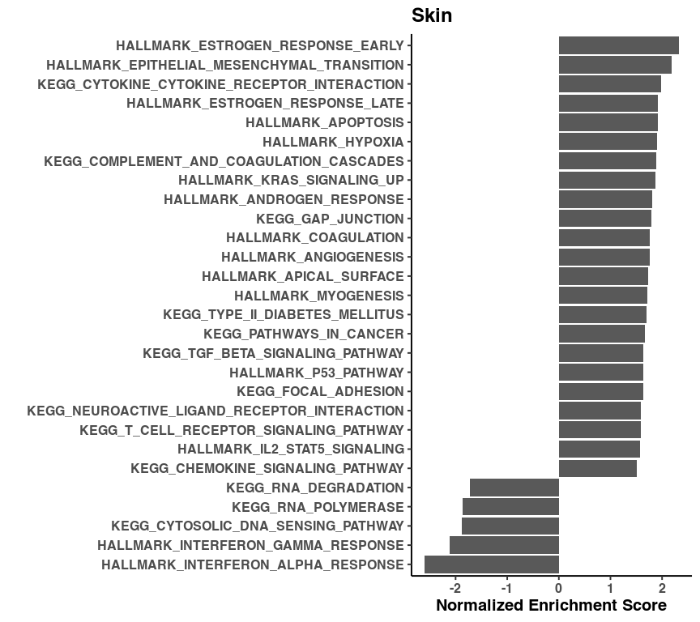
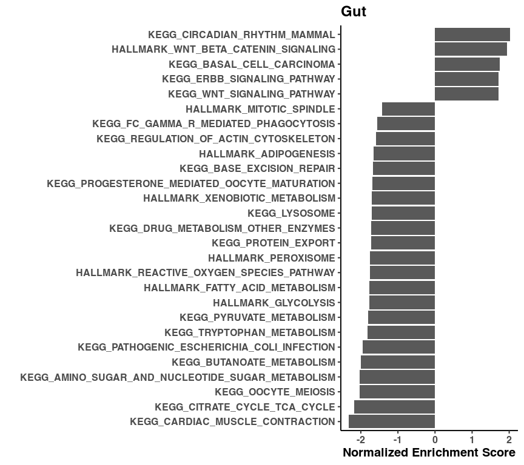
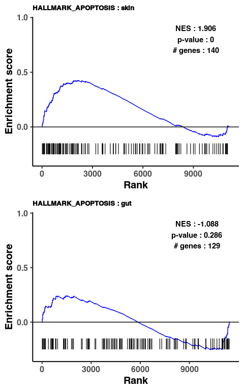
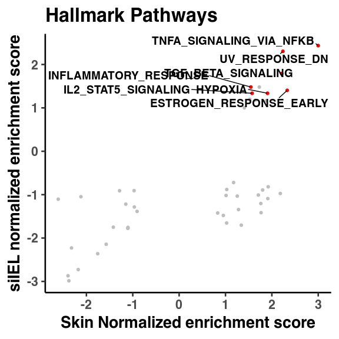
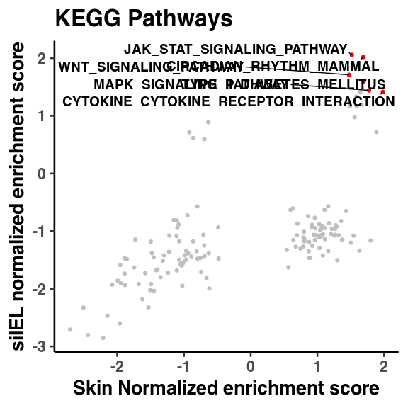

Supplemental figure 4
================

``` r
library(reticulate)
library(gtools)
library(tidyverse)
library(ggplot2)
library(ggrepel)
library(glue)
library(magrittr)
library(fgsea)
library(ggpubr)

use_python("/projects/home/nealpsmith/.conda/envs/old_peg_github/bin/python")
```

``` python
import getpass
import pegasus as pg
```

    ## WARNING:param.Parameterized: Use method 'warning' via param namespace 
    ## WARNING:param.main: pandas could not register all extension types imports failed with the following error: cannot import name 'ABCIndexClass' from 'pandas.core.dtypes.generic' (/projects/home/nealpsmith/.conda/envs/old_peg_github/lib/python3.7/site-packages/pandas/core/dtypes/generic.py)

``` python
import scanpy as sc
import os
import matplotlib.pyplot as plt
import pandas as pd
import numpy as np
import anndata
import math
import seaborn as sns
import matplotlib.colors as clr
from pylab import cm
import matplotlib as mpl
from matplotlib.lines import Line2D
from mpl_toolkits.axes_grid1 import make_axes_locatable
from scipy.sparse import csr_matrix
from collections import Counter
import wot
import pickle

from cellrank.external.kernels import WOTKernel
from cellrank.tl.kernels import ConnectivityKernel
from cellrank.tl.estimators import GPCCA
from mpl_toolkits.axes_grid1 import make_axes_locatable, Size
import wot

mpl.rcParams['axes.spines.right'] = False
mpl.rcParams['axes.spines.top'] = False
# mpl.rcParams['pdf.fonttype'] = 42

# Set a colormap
gene_colormap = clr.LinearSegmentedColormap.from_list('gene_cmap', ["#e0e0e1", '#4576b8', '#02024a'], N=200)

cmap = cm.get_cmap('YlOrRd', 110)    # PiYG
hex_list = []
for i in range(cmap.N):
    rgba = cmap(i)
    # rgb2hex accepts rgb or rgba
    hex_list.append(mpl.colors.rgb2hex(rgba))

colors = [c for n, c in enumerate(hex_list) if n%10 == 0]
colors = colors [1:11] # First one is too dim
days = ["0", "2", "5", "10", "15", "20", "25", "30", "45", "60"]

day_col_dict = dict(zip(days, colors))
day_cmap = clr.LinearSegmentedColormap.from_list('day_cmap', colors, N=len(colors))

# Set a switcher up so the script will run on any computer
def file_path(user = getpass.getuser()):
    switcher = {
            "nealp": "C:/Users/nealp/Documents/Dropbox (Partners HealthCare)/Chloe&Mazen/Collaborator_projects/Kupper_TRM/neal_analysis/all_data_analysis",
            "neal": "/home/neal/Documents/Dropbox (Partners HealthCare)/Chloe&Mazen/Collaborator_projects/Kupper_TRM/neal_analysis/all_data_analysis",
            "nealpsmith": "/projects/home/nealpsmith/projects/kupper/all_data_analysis"

    }
    if switcher.get(user):
        return(switcher.get(user))
    else :
        print("Add your local filepath to the switcher! run getpass.getuser() to get your ID")

filtered2_no_skin2 = pg.read_input(
    os.path.join(file_path(), "data", "integrated", "filtered2_no_skin2_harmonized_with_subclust.h5ad"))
```

    ## 2023-09-27 16:05:03,966 - pegasus - INFO - Time spent on 'read_input' = 5.04s.

``` r
# Read in the linear modeling results, scrip for this is in fig 3 script
res_skin <- read.csv("/projects/home/nealpsmith/projects/kupper/all_data_analysis/data/integrated/pseudobulk/lin_modelling_subclusters/skin1_by_day_all_genes.csv", row.names = 1)


mouse_to_human <- read.csv("/projects/home/nealpsmith/data/useful/human_to_mouse_genes.csv")
# Make the gene name column the same
colnames(res_skin)[colnames(res_skin) == "gene"] <- "MGI.symbol"

res2_skin <- res_skin %>%
  dplyr::select(MGI.symbol, stat) %>%
  na.omit() %>%
  distinct() %>%
  group_by(MGI.symbol) %>%
  summarize(stat=mean(stat)) %>%
  left_join(mouse_to_human, by = "MGI.symbol") %>%
  dplyr::select(HGNC.symbol, stat) %>%
  na.omit()

skin_ranks <- deframe(res2_skin)

gene_sets <- gmtPathways("/projects/home/nealpsmith/projects/kupper/all_data_analysis/data/msigdb_symbols.gmt")

set <- "KEGG|HALLMARK"

gene_set_group = gene_sets[grep(set, names(gene_sets))]

skin_gsea <- fgsea(pathways = gene_set_group, stats=skin_ranks, nperm=10000) %>%
   dplyr::select(pathway, pval, padj, NES) %>%
  `colnames<-`(c("pathway", "skin_pval", "skin_padj", "skin_NES"))
```

    ## Warning in fgsea(pathways = gene_set_group, stats = skin_ranks, nperm = 10000):
    ## You are trying to run fgseaSimple. It is recommended to use fgseaMultilevel. To
    ## run fgseaMultilevel, you need to remove the nperm argument in the fgsea function
    ## call.

    ## Warning in preparePathwaysAndStats(pathways, stats, minSize, maxSize, gseaParam, : There are ties in the preranked stats (3.2% of the list).
    ## The order of those tied genes will be arbitrary, which may produce unexpected results.

    ## Warning in preparePathwaysAndStats(pathways, stats, minSize, maxSize,
    ## gseaParam, : There are duplicate gene names, fgsea may produce unexpected
    ## results.

``` r
## Now the gut ###
res_gut <- read.csv("/projects/home/nealpsmith/projects/kupper/kurd_paper/data/pseudobulk/lin_modelling_subclusters/gut1_by_day_all_genes.csv", row.names = 1)
colnames(res_gut)[colnames(res_gut) == "gene"] <- "MGI.symbol"

res2_gut <- res_gut %>%
  dplyr::select(MGI.symbol, stat) %>%
  na.omit() %>%
  distinct() %>%
  group_by(MGI.symbol) %>%
  summarize(stat=mean(stat)) %>%
  left_join(mouse_to_human, by = "MGI.symbol") %>%
  dplyr::select(HGNC.symbol, stat) %>%
  na.omit()

gut_ranks <- deframe(res2_gut)

set <- "KEGG|HALLMARK"

gene_set_group = gene_sets[grep(set, names(gene_sets))]

gut_gsea <- fgsea(pathways = gene_set_group, stats=gut_ranks, nperm=10000) %>%
  dplyr::select(pathway, pval, padj, NES) %>%
  `colnames<-`(c("pathway", "gut_pval", "gut_padj", "gut_NES"))
```

    ## Warning in fgsea(pathways = gene_set_group, stats = gut_ranks, nperm = 10000):
    ## You are trying to run fgseaSimple. It is recommended to use fgseaMultilevel. To
    ## run fgseaMultilevel, you need to remove the nperm argument in the fgsea function
    ## call.

    ## Warning in preparePathwaysAndStats(pathways, stats, minSize, maxSize, gseaParam, : There are ties in the preranked stats (3.91% of the list).
    ## The order of those tied genes will be arbitrary, which may produce unexpected results.

    ## Warning in preparePathwaysAndStats(pathways, stats, minSize, maxSize,
    ## gseaParam, : There are duplicate gene names, fgsea may produce unexpected
    ## results.

``` r
all_gsea_info <- skin_gsea %>%
  dplyr::left_join(gut_gsea, by = "pathway")

shared_up <- all_gsea_info %>%
  dplyr::filter(skin_padj < 0.05, gut_padj < 0.05, skin_NES > 1, gut_NES > 1) %>%
  .$pathway
shared_down <- all_gsea_info %>%
  dplyr::filter(skin_padj < 0.05, gut_padj < 0.05, skin_NES < -1, gut_NES < -1) %>%
  .$pathway
shared_all <- c(shared_up, shared_down)


skin_res <- skin_gsea %>%
  as_tibble() %>%
  dplyr::filter(!pathway %in% shared_all) %>%
  arrange(desc(skin_NES))
n_plot <- nrow(skin_res[skin_res$skin_padj < 0.05 & abs(skin_res$skin_NES) > 1,])
ggplot(skin_res[skin_res$skin_padj < 0.05 & abs(skin_res$skin_NES) > 1,],
       aes(reorder(pathway, skin_NES), skin_NES)) +
  coord_flip() +
  geom_col() +
  labs(x="", y="Normalized Enrichment Score",
       title= "Skin")+
  theme_classic(base_size = 15)
```

<!-- -->

``` r
gut_res <- gut_gsea %>%
  as_tibble() %>%
  dplyr::filter(!pathway %in% shared_all) %>%
  arrange(desc(gut_NES))
n_plot <- nrow(gut_res[gut_res$gut_padj < 0.05 & abs(gut_res$gut_NES) > 1,])

ggplot(gut_res[gut_res$gut_padj < 0.05 & abs(gut_res$gut_NES) > 1,],
       aes(reorder(pathway, gut_NES), gut_NES)) +
  coord_flip() +
  geom_col() +
  labs(x="", y="Normalized Enrichment Score",
       title= "Gut")+
  theme_classic(base_size = 15)
```

<!-- -->

``` r
test_pathway <- "HALLMARK_APOPTOSIS"
pathway_to_test <- gene_sets[test_pathway]
rank_list <- list("skin" = skin_ranks, "gut" = gut_ranks)
plot_list <- list()
gsea_res <- data.frame()
for (i in 1:length(rank_list)){

  ranks <- rank_list[[i]]

  fgsea_res <- fgsea(pathways = pathway_to_test, stats = ranks, nperm = 10000)
  fgsea_res$tissue <- names(rank_list[i])
  gsea_res <- rbind(gsea_res, fgsea_res)
  annot <- names(rank_list[i])

  nes <- round(fgsea_res$NES[fgsea_res$pathway == test_pathway], 3)
  pval <- round(fgsea_res$pval[fgsea_res$pathway == test_pathway], 3)
  n_genes <- fgsea_res$size[fgsea_res$pathway == test_pathway]

  rnk <- rank(-ranks)
  ord <- order(rnk)

  statsAdj <- ranks[ord]
  statsAdj <- sign(statsAdj) * (abs(statsAdj) ^ 1)
  statsAdj <- statsAdj / max(abs(statsAdj))

  pathway <- unname(as.vector(na.omit(match(pathway_to_test[[test_pathway]], names(statsAdj)))))
  pathway <- sort(pathway)

  gseaRes <- calcGseaStat(statsAdj, selectedStats = pathway,
                            returnAllExtremes = TRUE)

  bottoms <- gseaRes$bottoms
  tops <- gseaRes$tops

  n <- length(statsAdj)
  xs <- as.vector(rbind(pathway - 1, pathway))
  ys <- as.vector(rbind(bottoms, tops))
  toPlot <- data.frame(x=c(0, xs, n + 1), y=c(0, ys, 0))

  diff <- (max(tops) - min(bottoms)) / 8

  x=y=NULL

  p <- ggplot(toPlot, aes(x = x, y = y)) +
    # geom_point(color="blue", size=0.1) +
    geom_line(color="blue") +
    geom_hline(yintercept=0, colour="black") +
    geom_segment(data=data.frame(x=pathway),
                     mapping=aes(x=x, y=-0.15,
                                 xend=x, yend=-0.25),
                     size=0.4) +
    scale_y_continuous(expand = c(0.05,0.05)) +
    scale_x_continuous(breaks = seq(0, 9000, 3000)) +
    xlab("Rank") + ylab("Enrichment score") +
    geom_text(aes(label = "")) +
    annotate("text", label = glue("NES : {nes}"), x = length(ranks) - 2000, y  =0.9) +
    annotate("text", label = glue("p-value : {pval}"), x = length(ranks) - 2000, y = 0.8) +
    annotate("text", label = glue("# genes : {n_genes}"), x = length(ranks) - 2000, y = 0.7) +
    ggtitle(glue("{test_pathway} : {annot}")) +
    theme_classic(base_size = 15) +
    theme(plot.title = element_text(face = "bold", size = 10))
  plot_list <- c(plot_list, list(p))
}
```

    ## Warning in fgsea(pathways = pathway_to_test, stats = ranks, nperm = 10000): You
    ## are trying to run fgseaSimple. It is recommended to use fgseaMultilevel. To run
    ## fgseaMultilevel, you need to remove the nperm argument in the fgsea function
    ## call.

    ## Warning in preparePathwaysAndStats(pathways, stats, minSize, maxSize, gseaParam, : There are ties in the preranked stats (3.2% of the list).
    ## The order of those tied genes will be arbitrary, which may produce unexpected results.

    ## Warning in preparePathwaysAndStats(pathways, stats, minSize, maxSize,
    ## gseaParam, : There are duplicate gene names, fgsea may produce unexpected
    ## results.

    ## Warning: Using `size` aesthetic for lines was deprecated in ggplot2 3.4.0.
    ## ℹ Please use `linewidth` instead.

    ## Warning in fgsea(pathways = pathway_to_test, stats = ranks, nperm = 10000): You
    ## are trying to run fgseaSimple. It is recommended to use fgseaMultilevel. To run
    ## fgseaMultilevel, you need to remove the nperm argument in the fgsea function
    ## call.

    ## Warning in preparePathwaysAndStats(pathways, stats, minSize, maxSize, gseaParam, : There are ties in the preranked stats (3.91% of the list).
    ## The order of those tied genes will be arbitrary, which may produce unexpected results.

    ## Warning in preparePathwaysAndStats(pathways, stats, minSize, maxSize,
    ## gseaParam, : There are duplicate gene names, fgsea may produce unexpected
    ## results.

``` r
ggarrange(plotlist = plot_list, ncol = 1)
```

<!-- -->

``` r
plot_df <- all_gsea_info %>%
  dplyr::filter(grepl("HALLMARK", .$pathway))
plot_df$pathway <- sapply(plot_df$pathway, function(x) sub("HALLMARK_", "", x))
ggplot(plot_df, aes(x = skin_NES, y = gut_NES)) +
  geom_point(data = plot_df[plot_df$gut_NES < 0 | plot_df$skin_NES < 0 |
                                    plot_df$skin_padj < 0.1 | plot_df$gut_NES < 0,], color = "grey") +
  geom_point(data = plot_df[plot_df$gut_padj < 0.1 & plot_df$skin_padj < 0.1 &
                                    plot_df$gut_NES > 0 & plot_df$skin_NES > 0,], color = "red") +
  geom_text_repel(data = plot_df[plot_df$gut_padj < 0.1 & plot_df$skin_padj < 0.1 &
                                    plot_df$gut_NES > 0 & plot_df$skin_NES > 0,], aes(label = pathway), size = 5,
                  min.segment.length = 0.1) +
  xlab("Skin Normalized enrichment score") + ylab("siIEL normalized enrichment score") +
  ggtitle("Hallmark Pathways") +
  theme_classic(base_size = 20)
```

<!-- -->

``` r
plot_df <- all_gsea_info %>%
  dplyr::filter(grepl("KEGG", .$pathway))
plot_df$pathway <- sapply(plot_df$pathway, function(x) sub("KEGG_", "", x))
ggplot(plot_df, aes(x = skin_NES, y = gut_NES)) +
  geom_point(data = plot_df[plot_df$gut_NES < 0 | plot_df$skin_NES < 0 |
                                    plot_df$skin_padj < 0.1 | plot_df$gut_NES < 0,], color = "grey") +
  geom_point(data = plot_df[plot_df$gut_padj < 0.1 & plot_df$skin_padj < 0.1 &
                                    plot_df$gut_NES > 0 & plot_df$skin_NES > 0,], color = "red") +
  geom_text_repel(data = plot_df[plot_df$gut_padj < 0.1 & plot_df$skin_padj < 0.1 &
                                    plot_df$gut_NES > 0 & plot_df$skin_NES > 0,], aes(label = pathway), size = 5,
                  min.segment.length = 0.1) +
  xlab("Skin Normalized enrichment score") + ylab("siIEL normalized enrichment score") +
  ggtitle("KEGG Pathways") +
  theme_classic(base_size = 20)
```

<!-- -->
