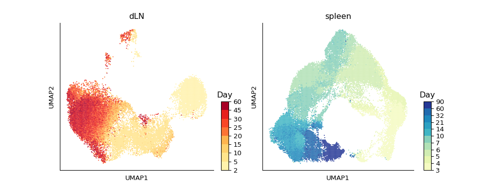
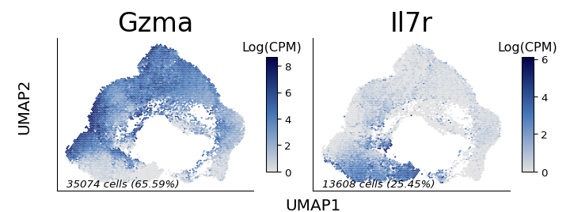
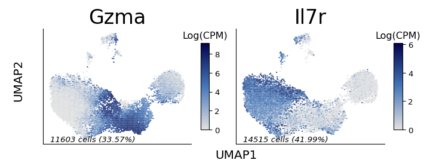
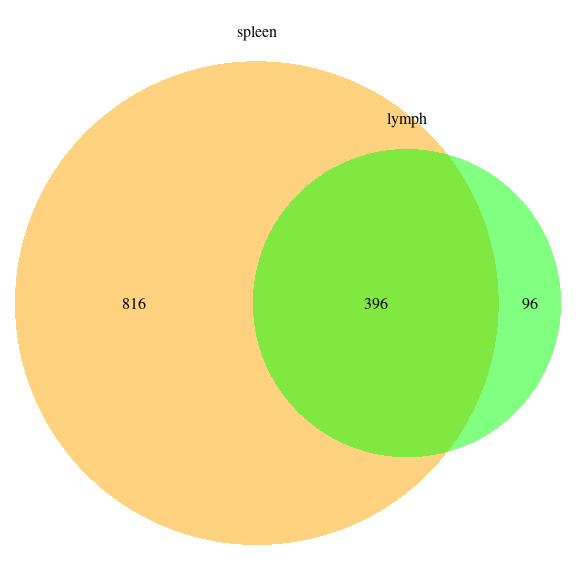
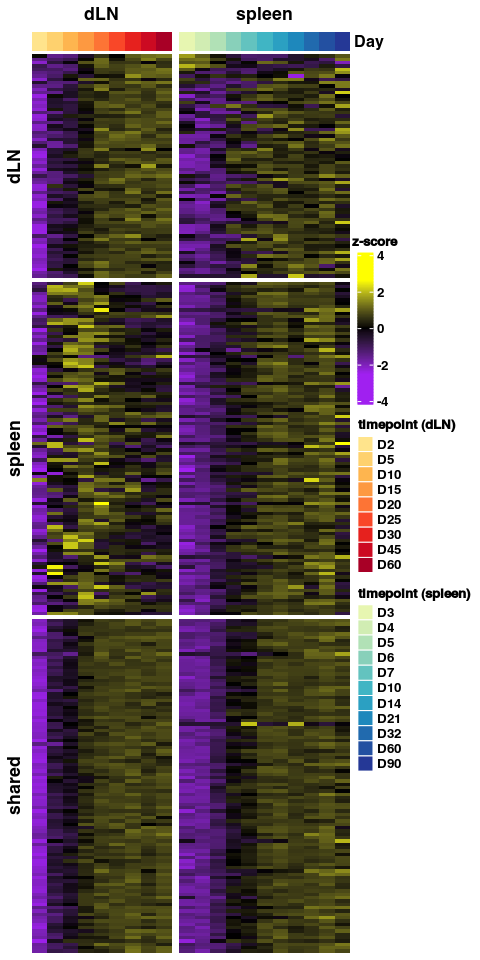

Supplemental figure 4
================

``` r
library(reticulate)
library(gtools)
library(tidyverse)
library(ggplot2)
library(DESeq2)
library(glue)
library(magrittr)
library(VennDiagram)
library(ComplexHeatmap)
library(circlize)
library(gridExtra)

use_python("/projects/home/nealpsmith/.conda/envs/old_peg_github/bin/python")
```

``` python
import getpass
import pegasus as pg
import scanpy as sc
import os
import matplotlib.pyplot as plt
import pandas as pd
import numpy as np
import anndata
import math
import seaborn as sns
import matplotlib.colors as clr
from pylab import cm
import matplotlib as mpl
from matplotlib.lines import Line2D
from mpl_toolkits.axes_grid1 import make_axes_locatable
from scipy.sparse import csr_matrix
from collections import Counter
import wot
import pickle

from cellrank.external.kernels import WOTKernel
from cellrank.tl.kernels import ConnectivityKernel
from cellrank.tl.estimators import GPCCA
from mpl_toolkits.axes_grid1 import make_axes_locatable, Size
import wot

mpl.rcParams['axes.spines.right'] = False
mpl.rcParams['axes.spines.top'] = False
# mpl.rcParams['pdf.fonttype'] = 42

# Set a colormap
gene_colormap = clr.LinearSegmentedColormap.from_list('gene_cmap', ["#e0e0e1", '#4576b8', '#02024a'], N=200)

cmap = cm.get_cmap('YlGnBu', 140)    # PiYG
hex_list = []
for i in range(cmap.N):
    rgba = cmap(i)
    # rgb2hex accepts rgb or rgba
    hex_list.append(mpl.colors.rgb2hex(rgba))

colors = [c for n, c in enumerate(hex_list) if n%10 == 0]
colors = colors [1:13] # First one is too dim
days = ["0", "3", "4", "5", "6", "7", "10", "14", "21", "32", "60", "90"]

day_col_dict = dict(zip(days, colors))
# Also make as a colormap
kurd_day_cmap = clr.LinearSegmentedColormap.from_list('day_cmap', colors, N=len(colors))

cmap = cm.get_cmap('YlOrRd', 110)    # PiYG
hex_list = []
for i in range(cmap.N):
    rgba = cmap(i)
    # rgb2hex accepts rgb or rgba
    hex_list.append(mpl.colors.rgb2hex(rgba))

colors = [c for n, c in enumerate(hex_list) if n%10 == 0]
colors = colors [1:11] # First one is too dim
days = ["0", "2", "5", "10", "15", "20", "25", "30", "45", "60"]

day_col_dict = dict(zip(days, colors))
kupper_day_cmap = clr.LinearSegmentedColormap.from_list('day_cmap', colors, N=len(colors))

# Set a switcher up so the script will run on any computer
def file_path(user = getpass.getuser()):
    switcher = {
            "nealp": "C:/Users/nealp/Documents/Dropbox (Partners HealthCare)/Chloe&Mazen/Collaborator_projects/Kupper_TRM/neal_analysis/",
            "neal": "/home/neal/Documents/Dropbox (Partners HealthCare)/Chloe&Mazen/Collaborator_projects/Kupper_TRM/neal_analysis/",
            "nealpsmith": "/projects/home/nealpsmith/projects/kupper/"

    }
    if switcher.get(user):
        return(switcher.get(user))
    else :
        print("Add your local filepath to the switcher! run getpass.getuser() to get your ID")
```

``` python

spleen_data = pg.read_input(os.path.join(file_path(), "kurd_paper", "data", "spleen1_data_subcluster.h5ad"))
```

    ## 2024-08-30 15:57:39,553 - pegasus - INFO - Time spent on 'read_input' = 4.72s.

``` python
ln_data = pg.read_input(os.path.join(file_path(), "all_data_analysis", "data", "integrated", "lymph_data_subcluster.h5ad"))
```

    ## 2024-08-30 15:57:41,983 - pegasus - INFO - Time spent on 'read_input' = 2.42s.

``` python
ln_data.obs["day"] = [int(d) for d in ln_data.obs["day"]]
data_dict = {"dLN" : ln_data, "spleen" : spleen_data}
day_cmaps = {"dLN": kupper_day_cmap, "spleen" : kurd_day_cmap}

### UMAP BY DAY ###
fig, ax = plt.subplots(nrows=1, ncols=2, figsize = (10, 4))
ax = ax.ravel()
for num, tissue in enumerate(data_dict.keys()) :
    dat = data_dict[tissue]
    plot_df = dat.obs[["day"]]
    int_dict = {k: v for k, v in zip(sorted(set(plot_df["day"]), key=int), range(len(set(plot_df["day"]))))}
    plot_df["day_int"] = [int_dict[d] for d in plot_df["day"]]
    plot_df["x"] = dat.obsm[f"X_umap"][:, 0]
    plot_df["y"] = dat.obsm[f"X_umap"][:, 1]
    # Get the colormap
    day_cmap = day_cmaps[tissue]
    ax[num].hexbin(plot_df["x"], plot_df["y"], C=plot_df["day_int"], cmap=day_cmap, gridsize=150, edgecolors="none")
    ax[num].get_xaxis().set_ticks([])
    ax[num].get_yaxis().set_ticks([])
    ax[num].set_xlabel("UMAP1")
    ax[num].set_ylabel("UMAP2")
    ax[num].set_title(tissue)

    divider = make_axes_locatable(ax[num])
    pad = 0.07
    pad_size = Size.Fraction(pad, Size.AxesY(ax[num]))

    xsize = Size.Fraction(0.05, Size.AxesX(ax[num]))
    ysize = Size.Fraction(0.5 - pad / 2., Size.AxesY(ax[num]))

    divider.set_horizontal([Size.AxesX(ax[num]), pad_size, xsize])
    divider.set_vertical([ysize, pad_size, ysize])

    ax[num].set_axes_locator(divider.new_locator(0, 0, ny1=-1))

    cax = mpl.axes.Axes(ax[num].get_figure(),
                        ax[num].get_position(original=True))
    locator = divider.new_locator(nx=2, ny=0)
    cax.set_axes_locator(locator)

    fig.add_axes(cax)
    plot_df["day"] = plot_df["day"].astype("object")
    bounds = np.array(sorted(set(plot_df["day"])))
    norm = mpl.colors.BoundaryNorm(bounds, day_cmap.N)

    cb = mpl.colorbar.ColorbarBase(cax, cmap=day_cmap, norm=norm,
                                   spacing='uniform', ticks=bounds, boundaries=bounds, format='%1i')
    cax.set_title("Day")

fig
```



``` python

gene_cats = {"eff_mem_genes" : ["Gzma", "Il7r"]}

x_loc = np.min(spleen_data.obsm["X_umap"][:, 0]) - np.min(spleen_data.obsm["X_umap"][:, 0]) * 0.01
y_loc = np.min(spleen_data.obsm["X_umap"][:, 1]) - 0.4

for name, genes in gene_cats.items():
    fig, ax = plt.subplots(ncols=2, nrows=1, figsize=(7.5, 2.8))
    ax = ax.ravel()

    for num, gene in enumerate(genes):
        # Calculate n cells and percent
        n_cells = spleen_data[:, gene].X.count_nonzero()
        perc_cells = n_cells / len(spleen_data) * 100
        perc_cells = round(perc_cells, 2)

        plot_df = pd.DataFrame(spleen_data[:, gene].X.toarray(), columns=[gene], index=spleen_data.obs_names)
        plot_df["x"] = spleen_data.obsm["X_umap"][:, 0]
        plot_df["y"] = spleen_data.obsm["X_umap"][:, 1]
        hb = ax[num].hexbin(plot_df["x"], plot_df["y"], C=plot_df[gene], cmap=gene_colormap, gridsize=100,
                            edgecolors="none")
        ax[num].get_xaxis().set_ticks([])
        ax[num].get_yaxis().set_ticks([])
        ax[num].spines['top'].set_visible(False)
        ax[num].spines['right'].set_visible(False)
        ax[num].set_title(gene, size=25)
        ax[num].text(x_loc, y_loc, f"{n_cells} cells ({perc_cells}%)", style="italic")
        cb = fig.colorbar(hb, ax=ax[num], shrink=.75, aspect=10)
        cb.ax.set_title("Log(CPM)")
    for noplot in range(num + 1, len(ax)):
        ax[noplot].axis("off")
    fig.text(0.5, 0.03, 'UMAP1', va='center', size=15)
    fig.text(0.03, 0.5, 'UMAP2', va='center', rotation='vertical', size=15)
    fig.tight_layout()
    plt.subplots_adjust(left=0.1, bottom=0.1)

fig
```



``` python
x_loc = np.min(ln_data.obsm["X_umap"][:,0]) - np.min(ln_data.obsm["X_umap"][:,0]) * 0.01
y_loc = np.min(ln_data.obsm["X_umap"][:,1]) - 0.4

for name, genes in gene_cats.items() :
    fig, ax = plt.subplots(ncols = 2, nrows = 1, figsize = (7.5, 2.8))
    ax = ax.ravel()

    for num, gene in enumerate(genes) :
        # Calculate n cells and percent
        n_cells = ln_data[:, gene].X.count_nonzero()
        perc_cells = n_cells / len(ln_data) * 100
        perc_cells = round(perc_cells, 2)

        plot_df = pd.DataFrame(ln_data[:,gene].X.toarray(), columns = [gene], index = ln_data.obs_names)
        plot_df["x"] = ln_data.obsm["X_umap"][:, 0]
        plot_df["y"] = ln_data.obsm["X_umap"][:, 1]
        hb = ax[num].hexbin(plot_df["x"], plot_df["y"], C=plot_df[gene], cmap=gene_colormap, gridsize=100, edgecolors = "none")
        ax[num].get_xaxis().set_ticks([])
        ax[num].get_yaxis().set_ticks([])
        ax[num].spines['top'].set_visible(False)
        ax[num].spines['right'].set_visible(False)
        ax[num].set_title(gene, size = 25)
        ax[num].text(x_loc, y_loc, f"{n_cells} cells ({perc_cells}%)", style="italic")
        cb = fig.colorbar(hb, ax=ax[num], shrink=.75, aspect=10)
        cb.ax.set_title("Log(CPM)")
    for noplot in range(num + 1, len(ax)) :
        ax[noplot].axis("off")
    fig.text(0.5, 0.03, 'UMAP1', va='center', size = 15)
    fig.text(0.03, 0.5, 'UMAP2', va='center', rotation='vertical', size = 15)
    fig.tight_layout()
    plt.subplots_adjust(left = 0.1, bottom = 0.1)

fig
```



``` r
padj_cutoff = 0.1
perc_cells_cutoff = 5
slope_cutoff = 0.15

# Load in the counts and metadata
count_data_lymph <- read.csv("/projects/home/nealpsmith/projects/kupper/all_data_analysis/data/integrated/lymph_subcluster_pseudobulk_on_time_counts.csv",
                     row.names = 1)
meta_data_lymph <- read.csv("/projects/home/nealpsmith/projects/kupper/all_data_analysis/data/integrated/lymph_subcluster_pseudobulk_on_time_meta.csv",
                  row.names = 1)

meta_temp <- meta_data_lymph[meta_data_lymph$n_cells > 100,]

# Need to adjust the int to the lowest point
meta_temp$day_int <- meta_temp$day_int - 1

count_temp <- count_data_lymph[,rownames(meta_temp)]

# Make sure the genes are detected in enough samples
n_samp <- rowSums(count_temp != 0)
count_temp <- count_temp[n_samp > round(nrow(meta_temp) / 2),]
count_temp <- count_temp[!grepl("Gm[0-9]|Rpl|Rps|mt-|-ps", rownames(count_temp)),]

# Okay now we can run DESeq
dds_lymph <- DESeqDataSetFromMatrix(countData = count_temp,
                            colData = meta_temp,
                            design = ~day_int)
dds_lymph <- DESeq(dds_lymph)
lymph_res <- as.data.frame(results(dds_lymph))
lymph_res <- lymph_res[!is.na(lymph_res$padj),]
lymph_res$gene <- rownames(lymph_res)
# Read in the single cell gene info
gene_info <- read.csv("/projects/home/nealpsmith/projects/kupper/all_data_analysis/data/integrated/lymph_subcluster_gene_info.csv") %>%
rename(feature = "gene")

lymph_res %<>%
  left_join(gene_info, by = "gene")

lymph_de <- lymph_res[lymph_res$padj < padj_cutoff & abs(lymph_res$log2FoldChange) > slope_cutoff &
                  lymph_res$percent_cells > perc_cells_cutoff,] %>%
    arrange(padj)

### Now the spleen ###
count_data_spleen <- read.csv("/projects/home/nealpsmith/projects/kupper/kurd_paper/data/spleen1_data_subcluster_pseudobulk_on_time_counts.csv",
                     row.names = 1)
meta_data_spleen <- read.csv("/projects/home/nealpsmith/projects/kupper/kurd_paper/data/spleen1_data_subcluster_pseudobulk_on_time_meta.csv",
                  row.names = 1)

meta_temp <- meta_data_spleen[meta_data_spleen$n_cells > 100,]
count_temp <- count_data_spleen[,rownames(meta_temp)]

# Make sure the genes are detected in enough samples
n_samp <- rowSums(count_temp != 0)
count_temp <- count_temp[n_samp > round(nrow(meta_temp) / 2),]
count_temp <- count_temp[!grepl("Gm[0-9]|Rpl|Rps|mt-|-ps", rownames(count_temp)),]

# Okay now we can run DESeq
dds_spleen <- DESeqDataSetFromMatrix(countData = count_temp,
                            colData = meta_temp,
                            design = ~day_int)
dds_spleen <- DESeq(dds_spleen)
spleen_res <- as.data.frame(results(dds_spleen))
spleen_res <- spleen_res[!is.na(spleen_res$padj),]
spleen_res$gene <- rownames(spleen_res)
# Read in the single cell gene info
gene_info <- read.csv("/projects/home/nealpsmith/projects/kupper/kurd_paper/data/spleen1_data_subcluster_gene_info.csv") %>%
  rename(feature = "gene")

spleen_res %<>%
  left_join(gene_info, by = "gene")

spleen_de <- spleen_res[spleen_res$padj < padj_cutoff & abs(spleen_res$log2FoldChange) > slope_cutoff &
                  spleen_res$percent_cells > perc_cells_cutoff,] %>%
  arrange(padj)

lymph_mem <- lymph_de[lymph_de$log2FoldChange > 0.15 & lymph_de$padj < 0.1 & lymph_de$percent_cells > 5,]
spleen_mem <- spleen_de[spleen_de$log2FoldChange > 0.15 & spleen_de$padj < 0.1 & spleen_de$percent_cells > 5,]
lymph_genes <- lymph_mem$gene
spleen_genes <- spleen_mem$gene
kupper_tcm <- intersect(lymph_mem$gene, spleen_mem$gene)


draw.pairwise.venn(length(lymph_genes), length(spleen_genes), length(kupper_tcm),
                   category = c("lymph", "spleen"), fill = c("green", "orange"),
                   lwd = rep(0, 2), cex = rep(unit(1, "cm"), 3),
                   cat.pos = c(180, 180), cat.cex = rep(unit(1, "cm"), 2))
```

<!-- -->

    ## (polygon[GRID.polygon.1624], polygon[GRID.polygon.1625], polygon[GRID.polygon.1626], polygon[GRID.polygon.1627], text[GRID.text.1628], text[GRID.text.1629], text[GRID.text.1630], text[GRID.text.1631], text[GRID.text.1632])

``` r
# Now need to log-norm
norm_res_kupper <- apply(count_data_lymph, 2, function(c){
  n_total <- sum(c)
  per_100k <- (c * 1000000) / n_total
  return(per_100k)
})

norm_res_kupper <- log1p(norm_res_kupper)

# Can we change the column names to just be timepoints?
colnames(norm_res_kupper) <- sapply(colnames(norm_res_kupper), function(x) strsplit(x, "_")[[1]][3])

# Now need to log-norm
norm_res_kurd <- apply(count_data_spleen, 2, function(c){
  n_total <- sum(c)
  per_100k <- (c * 1000000) / n_total
  return(per_100k)
})

norm_res_kurd <- log1p(norm_res_kurd)
colname_to_tmpt <- lapply(colnames(norm_res_kurd), function(x) paste("D", tail(strsplit(x, "_")[[1]], n = 1), sep = ""))
tmpts <- unique(sapply(colnames(norm_res_kurd), function(x) tail(strsplit(x, "_")[[1]], n = 1)))

norm_res_kurd <- lapply(tmpts, function(tpt){
  cols = as.data.frame(norm_res_kurd[,grepl(glue("*_{tpt}$"), colnames(norm_res_kurd))])
  if(ncol(cols) > 1){
   mean = rowMeans(cols) %>%
    as.data.frame() %>%
    `colnames<-`(glue("D{tpt}")) %>%
     rownames_to_column("gene")
  return(mean)
  } else {
    cols <- cols %>%
      `colnames<-`(glue("D{tpt}")) %>%
     rownames_to_column("gene")
    return(cols)
  }
}) %>%
  purrr::reduce(left_join, by = "gene") %>%
  column_to_rownames("gene")


# Now make the day annotation
day_colors = c('LN_D0'= '#fff2ac',
               'LN_D2'= '#ffe48c',
               'LN_D5'= '#fed16e',
               'LN_D10'= '#feb54f',
               'LN_D15'= '#fd9941',
               'LN_D20'= '#fd7435',
               'LN_D25'= '#f94728',
               'LN_D30'= '#e6211e',
               'LN_D45'= '#cc0a22',
               'LN_D60'= '#a80026',
               'spleen_D0'= '#f5fbc2',
               'spleen_D3'= '#e7f6b1',
               'spleen_D4'= '#d1edb3',
               'spleen_D5'= '#b1e1b6',
               'spleen_D6'= '#88d0ba',
               'spleen_D7'= '#63c3bf',
               'spleen_D10'= '#40b5c4',
               'spleen_D14'= '#2ba0c2',
               'spleen_D21'= '#1e88bc',
               'spleen_D32'= '#216aae',
               'spleen_D60'= '#2350a1',
               'spleen_D90'= '#253896')
ln_only <- lymph_mem$gene[!lymph_mem$gene %in% kupper_tcm]
ln_only <- ln_only[ln_only %in% rownames(norm_res_kurd)]

diff <- lapply(ln_only, function(x) lymph_res$log2FoldChange[lymph_res$gene == x] - spleen_res$log2FoldChange[spleen_res$gene == x])
ln_only_top_n <- data.frame(gene = ln_only, diff = unlist(diff)) %>%
  arrange(desc(diff)) %>%
  top_n(100) %>%
  .$gene
# Now for the spleen
spleen_only <- spleen_mem$gene[!spleen_mem$gene %in% kupper_tcm]
spleen_only <- spleen_only[spleen_only %in% lymph_res$gene]
diff <- lapply(spleen_only, function(x) spleen_res$log2FoldChange[spleen_res$gene == x] - lymph_res$log2FoldChange[lymph_res$gene == x])

spleen_only_top_n <- data.frame(gene = spleen_only, diff = unlist(diff)) %>%
  arrange(desc(diff)) %>%
  top_n(100) %>%
  .$gene

logfc_sum <- lapply(kupper_tcm, function(x) lymph_de$log2FoldChange[lymph_de$gene == x] + spleen_de$log2FoldChange[spleen_de$gene == x])

tcm_top_n <- data.frame(gene = kupper_tcm, sum = unlist(logfc_sum)) %>%
  arrange(desc(sum)) %>%
  top_n(100) %>%
  .$gene

heatmap_genes <- c(ln_only_top_n, spleen_only_top_n, tcm_top_n)
heatmap_genes <- heatmap_genes[heatmap_genes %in% rownames(norm_res_kurd) & heatmap_genes %in% rownames(norm_res_kupper)]

### Kupper heatmap ###
heatmap_mtx <- norm_res_kupper[heatmap_genes,]
heatmap_mtx <- t(scale(t(heatmap_mtx)))

# colnames(heatmap_mtx) <- sapply(colnames(heatmap_mtx), function(x) strsplit(x, "_")[[1]][3])

# Re-order to be ordered by day
heatmap_mtx <-heatmap_mtx[,mixedsort(colnames(heatmap_mtx))]

# Day bar
days <- colnames(heatmap_mtx)

# Now make the day annotation
day_colors = list("Day" = c('D0'= '#fff2ac',
                            'D2'= '#ffe48c',
                            'D5'= '#fed16e',
                            'D10'= '#feb54f',
                            'D15'= '#fd9941',
                            'D20'= '#fd7435',
                            'D25'= '#f94728',
                            'D30'= '#e6211e',
                            'D45'= '#cc0a22',
                            'D60'= '#a80026'))

days <- factor(days, levels = c("D0", "D2", "D5", "D10", "D15", "D20", "D25", "D30", "D45", "D60"))
days <- droplevels(days)
day_bar = HeatmapAnnotation("Day" = days, col = day_colors,
                            show_legend = FALSE, show_annotation_name = FALSE)
# Heatmap colors
heatmap_col_fun = colorRamp2(c(min(heatmap_mtx), 0, max(heatmap_mtx)), c("purple", "black", "yellow"))

# Lets make the legends
day_fill <- sapply(levels(days), function(x) day_colors$Day[as.character(x)])
day_legend_ln <- Legend(labels = levels(days), legend_gp = gpar(fill = day_fill), title = "timepoint (dLN)")

heatmap_lgd = Legend(col_fun = heatmap_col_fun, title = "z-score", legend_height = unit(4, "cm"), title_position = "topcenter")

lgd_list <- packLegend(heatmap_lgd, day_legend_ln, column_gap = unit(1,"cm"), direction = "vertical",
                     max_height = unit(14, "cm"))

# Get the split
split <- c(rep("dLN", length(ln_only_top_n)), rep("spleen", length(spleen_only_top_n)), rep("shared", length(tcm_top_n)))
# split <- c(rep("both", length(kupper_tcm)), rep("ln", length(ln_only)), rep("spleen", length(spleen_only)))

split <- factor(split, levels = c("dLN", "spleen", "shared"))

kupper_hmap = Heatmap(heatmap_mtx, name = "z-score", col = heatmap_col_fun,
                 top_annotation = day_bar, show_column_names = FALSE, show_row_names = FALSE,
                 cluster_columns = FALSE, cluster_rows = FALSE,
                      show_heatmap_legend = FALSE, split = split,
                      column_title = "dLN")

heatmap_mtx_kurd <- norm_res_kurd[heatmap_genes,]

# Get the average of the repeated timepoints
# colname_to_tmpt <- lapply(colnames(heatmap_mtx_kurd), function(x) paste("D", tail(strsplit(x, "_")[[1]], n = 1), sep = ""))
tmpts <- unique(sapply(colnames(heatmap_mtx_kurd), function(x) tail(strsplit(x, "_")[[1]], n = 1)))


heatmap_mtx_kurd <- t(scale(t(heatmap_mtx_kurd)))

# Re-order to be ordered by day
heatmap_mtx_kurd <-heatmap_mtx_kurd[,mixedsort(colnames(heatmap_mtx_kurd))]

days <- colnames(heatmap_mtx_kurd)

day_colors = list("Day" = c('D0'= '#f5fbc2',
                            'D3'= '#e7f6b1',
                            'D4'= '#d1edb3',
                            'D5'= '#b1e1b6',
                            'D6'= '#88d0ba',
                            'D7'= '#63c3bf',
                            'D10'= '#40b5c4',
                            'D14'= '#2ba0c2',
                            'D21'= '#1e88bc',
                            'D32'= '#216aae',
                            'D60'= '#2350a1',
                            'D90'= '#253896'))

days <- factor(days, levels = c("D0", "D3", "D4", "D5", "D6", "D7", "D10", "D14", "D21", "D32", "D60", "D90"))
days <- droplevels(days)
day_bar = HeatmapAnnotation("Day" = days, col = day_colors,
                            show_legend = FALSE)

# Heatmap colors
heatmap_col_fun = colorRamp2(c(min(heatmap_mtx_kurd), 0, max(heatmap_mtx_kurd)), c("purple", "black", "yellow"))

# Lets make the legends
day_fill <- sapply(levels(days), function(x) day_colors$Day[as.character(x)])
day_legend_spleen <- Legend(labels = levels(days), legend_gp = gpar(fill = day_fill), title = "timepoint (spleen)")

heatmap_lgd = Legend(col_fun = heatmap_col_fun, title = "z-score", legend_height = unit(4, "cm"), title_position = "topcenter")


lgd_list <- packLegend(heatmap_lgd, day_legend_ln, day_legend_spleen, column_gap = unit(1,"cm"), direction = "vertical",
                     max_height = unit(20, "cm"))


kurd_hmap = Heatmap(heatmap_mtx_kurd, name = "z-score", col = heatmap_col_fun,
               top_annotation = day_bar,
               show_column_names = FALSE,
               show_row_names = FALSE,
               cluster_columns = FALSE,
                    cluster_rows = FALSE,
                    show_heatmap_legend = FALSE,
                    split = split,
                    column_title = "spleen")
hmap_list <- kupper_hmap + kurd_hmap
draw(hmap_list, heatmap_legend_list = lgd_list)
```

<!-- -->
