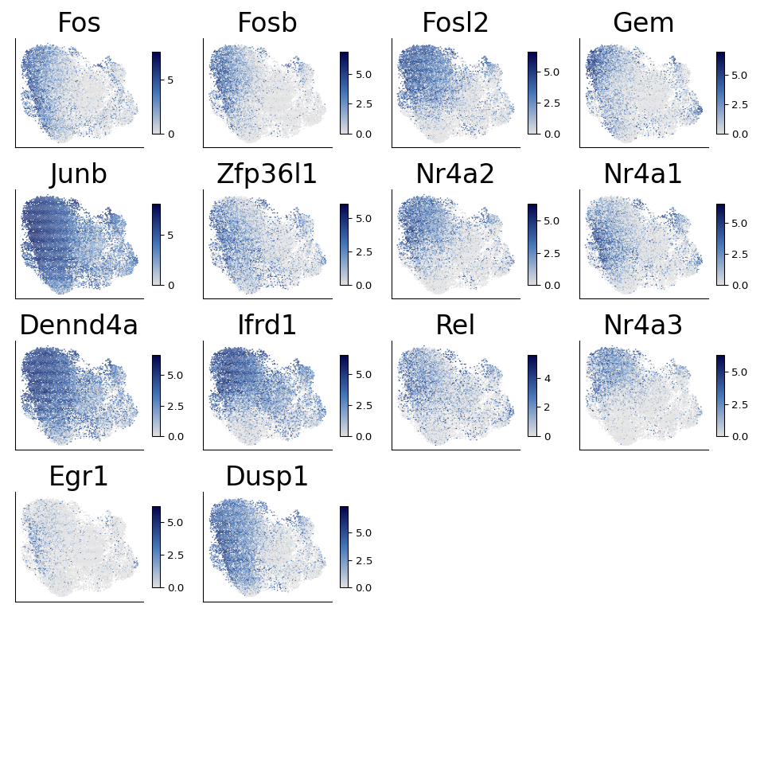
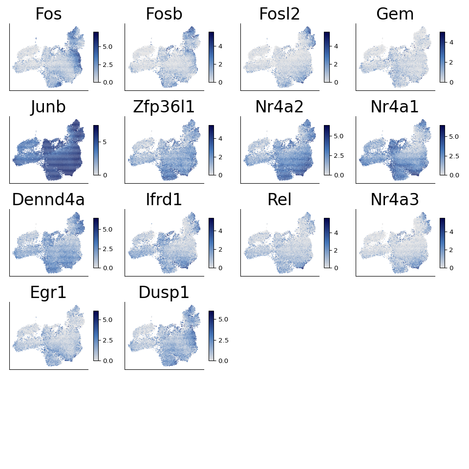

Supplemental figure 7
================

``` r
library(reticulate)
use_python("/projects/home/nealpsmith/.conda/envs/old_peg_github/bin/python")
```

``` python
import getpass
import pegasus as pg
```

    ## WARNING:param.Parameterized: Use method 'warning' via param namespace 
    ## WARNING:param.main: pandas could not register all extension types imports failed with the following error: cannot import name 'ABCIndexClass' from 'pandas.core.dtypes.generic' (/projects/home/nealpsmith/.conda/envs/old_peg_github/lib/python3.7/site-packages/pandas/core/dtypes/generic.py)

``` python
import scanpy as sc
import os
import matplotlib.pyplot as plt
import pandas as pd
import numpy as np
import anndata
import seaborn as sns
import matplotlib.colors as clr
from pylab import cm
import matplotlib as mpl
from matplotlib.lines import Line2D
from collections import Counter

mpl.rcParams['axes.spines.right'] = False
mpl.rcParams['axes.spines.top'] = False
# mpl.rcParams['pdf.fonttype'] = 42

# Set a colormap
gene_colormap = clr.LinearSegmentedColormap.from_list('gene_cmap', ["#e0e0e1", '#4576b8', '#02024a'], N=200)

cmap = cm.get_cmap('YlGnBu', 140)    # PiYG
hex_list = []
for i in range(cmap.N):
    rgba = cmap(i)
    # rgb2hex accepts rgb or rgba
    hex_list.append(mpl.colors.rgb2hex(rgba))

colors = [c for n, c in enumerate(hex_list) if n%10 == 0]
colors = colors [1:13] # First one is too dim
days = ["0", "3", "4", "5", "6", "7", "10", "14", "21", "32", "60", "90"]

day_col_dict = dict(zip(days, colors))
# Also make as a colormap
kurd_day_cmap = clr.LinearSegmentedColormap.from_list('day_cmap', colors, N=len(colors))

cmap = cm.get_cmap('YlOrRd', 110)    # PiYG
hex_list = []
for i in range(cmap.N):
    rgba = cmap(i)
    # rgb2hex accepts rgb or rgba
    hex_list.append(mpl.colors.rgb2hex(rgba))

colors = [c for n, c in enumerate(hex_list) if n%10 == 0]
colors = colors [1:11] # First one is too dim
days = ["0", "2", "5", "10", "15", "20", "25", "30", "45", "60"]

day_col_dict = dict(zip(days, colors))
kupper_day_cmap = clr.LinearSegmentedColormap.from_list('day_cmap', colors, N=len(colors))

# Set a switcher up so the script will run on any computer
def file_path(user = getpass.getuser()):
    switcher = {
            "nealp": "C:/Users/nealp/Documents/Dropbox (Partners HealthCare)/Chloe&Mazen/Collaborator_projects/Kupper_TRM/neal_analysis/",
            "neal": "/home/neal/Documents/Dropbox (Partners HealthCare)/Chloe&Mazen/Collaborator_projects/Kupper_TRM/neal_analysis/",
            "nealpsmith": "/projects/home/nealpsmith/projects/kupper/"

    }
    if switcher.get(user):
        return(switcher.get(user))
    else :
        print("Add your local filepath to the switcher! run getpass.getuser() to get your ID")

skin1_data = pg.read_input(os.path.join(file_path(), "all_data_analysis", "data", "integrated", "skin1_subcluster.h5ad"))
```

    ## 2023-09-27 18:12:19,071 - pegasus - INFO - Time spent on 'read_input' = 1.50s.

``` python
gut1_data = pg.read_input(os.path.join(file_path(), "kurd_paper", "data", "gut1_data_subcluster.h5ad"))
```

    ## 2023-09-27 18:12:22,105 - pegasus - INFO - Time spent on 'read_input' = 3.02s.

``` python

genes = ["Fos", "Fosb", "Fosl2", "Gem", "Junb", "Zfp36l1", "Nr4a2", "Nr4a1",
         "Dennd4a", "Ifrd1", "Rel", "Nr4a3", "Egr1", "Dusp1"]

ncols = int(round(np.sqrt(len(genes))))
fig, ax = plt.subplots(ncols = ncols, nrows = ncols + 1, figsize = (10, 10))
ax = ax.ravel()

for num, gene in enumerate(genes) :
    plot_df = pd.DataFrame(skin1_data[:,gene].X.toarray(), columns = [gene], index = skin1_data.obs_names)
    plot_df["x"] = skin1_data.obsm["X_umap"][:, 0]
    plot_df["y"] = skin1_data.obsm["X_umap"][:, 1]
    hb = ax[num].hexbin(plot_df["x"], plot_df["y"], C=plot_df[gene], cmap=gene_colormap, gridsize=100, edgecolors = "none")
    ax[num].get_xaxis().set_ticks([])
    ax[num].get_yaxis().set_ticks([])
    ax[num].spines['top'].set_visible(False)
    ax[num].spines['right'].set_visible(False)
    ax[num].set_title(gene, size = 25)
    cb = fig.colorbar(hb, ax=ax[num], shrink=.75, aspect=10)

for noplot in range(num + 1, len(ax)) :
    ax[noplot].axis("off")
```

    ## (0.0, 1.0, 0.0, 1.0)
    ## (0.0, 1.0, 0.0, 1.0)
    ## (0.0, 1.0, 0.0, 1.0)
    ## (0.0, 1.0, 0.0, 1.0)
    ## (0.0, 1.0, 0.0, 1.0)
    ## (0.0, 1.0, 0.0, 1.0)

``` python
fig.tight_layout()
fig
```



``` python

fig, ax = plt.subplots(ncols = ncols, nrows = ncols + 1, figsize = (10, 10))
ax = ax.ravel()

for num, gene in enumerate(genes) :
    plot_df = pd.DataFrame(gut1_data[:,gene].X.toarray(), columns = [gene], index = gut1_data.obs_names)
    plot_df["x"] = gut1_data.obsm["X_umap"][:, 0]
    plot_df["y"] = gut1_data.obsm["X_umap"][:, 1]
    hb = ax[num].hexbin(plot_df["x"], plot_df["y"], C=plot_df[gene], cmap=gene_colormap, gridsize=100, edgecolors = "none")
    ax[num].get_xaxis().set_ticks([])
    ax[num].get_yaxis().set_ticks([])
    ax[num].spines['top'].set_visible(False)
    ax[num].spines['right'].set_visible(False)
    ax[num].set_title(gene, size = 25)
    cb = fig.colorbar(hb, ax=ax[num], shrink=.75, aspect=10)

for noplot in range(num + 1, len(ax)) :
    ax[noplot].axis("off")
```

    ## (0.0, 1.0, 0.0, 1.0)
    ## (0.0, 1.0, 0.0, 1.0)
    ## (0.0, 1.0, 0.0, 1.0)
    ## (0.0, 1.0, 0.0, 1.0)
    ## (0.0, 1.0, 0.0, 1.0)
    ## (0.0, 1.0, 0.0, 1.0)

``` python
fig.tight_layout()
fig
```


