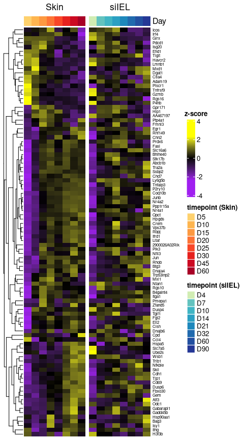

Supplemental figure 7
================

``` r
library(reticulate)
library(gtools)
library(tidyverse)
library(ggplot2)
library(DESeq2)
library(glue)
library(magrittr)
library(ComplexHeatmap)
library(circlize)
library(gridExtra)
library(ggrepel)
library(ggpubr)

use_python("/projects/home/nealpsmith/.conda/envs/old_peg_github/bin/python")
```

``` r
# Lets load in the milner et al gene set
milner_sigs <- read.csv("/projects/home/nealpsmith/projects/kupper/all_data_analysis/data/integrated/trm_tcm_signatures_milner_2017.csv")

milner_trm <- milner_sigs$core_trm_signature

# Lets look at the overlap with the "core signature" we have from skin + gut
skin_de <- read.csv("/projects/home/nealpsmith/projects/kupper/all_data_analysis/data/integrated/pseudobulk/lin_modelling_subclusters/skin1_by_day_padj_0.1_fc_0.2_perc_5.csv",
                    row.names = 1)

gut_de <- read.csv("/projects/home/nealpsmith/projects/kupper/kurd_paper/data/pseudobulk/lin_modelling_subclusters/gut1_by_day_padj_0.1_fc_0.2_perc_5.csv",
                   row.names = 1)

# memory first
skin_mem <- skin_de[skin_de$log2FoldChange > 0,]
gut_mem <- gut_de[gut_de$log2FoldChange > 0,]

skin_genes <- skin_mem$gene
gut_genes <- gut_mem$gene
kupper_trm <- intersect(skin_genes, gut_genes)

milner_kupper_trm_overlap <- intersect(kupper_trm, milner_trm)


# Load in the counts and metadata
count_data <- read.csv("/projects/home/nealpsmith/projects/kupper/all_data_analysis/data/integrated/skin1_subcluster_pseudobulk_on_time_counts.csv",
                       row.names = 1)
meta_data <- read.csv("/projects/home/nealpsmith/projects/kupper/all_data_analysis/data/integrated/skin1_subcluster_pseudobulk_on_time_meta.csv",
                    row.names = 1)

meta_temp <- meta_data[meta_data$n_cells > 100,]

# Remove the extra D30 sample, seems unfair to only have 2 samples for one timepoint
meta_temp <- meta_temp[rownames(meta_temp) != "samp_19_D30_Skin_30",]
# Need to adjust the int to the lowest point
meta_temp$day_int <- meta_temp$day_int - 2

count_temp <- count_data[,rownames(meta_temp)]

# Make sure the genes are detected in enough samples
n_samp <- rowSums(count_temp != 0)
count_temp <- count_temp[n_samp > round(nrow(meta_temp) / 2),]
count_temp <- count_temp[!grepl("Gm[0-9]|Rpl|Rps|mt-|-ps", rownames(count_temp)),]

# Okay now we can run DESeq
dds <- DESeqDataSetFromMatrix(countData = count_temp,
                              colData = meta_temp,
                              design = ~day_int)
dds <- DESeq(dds)

vsd <- vst(dds, blind=TRUE)
norm_res <- assay(vsd)

# Now lets get the gut data
count_data <- read.csv("/projects/home/nealpsmith/projects/kupper/kurd_paper/data/gut1_data_subcluster_pseudobulk_on_time_counts.csv",
                       row.names = 1)
meta_data <- read.csv("/projects/home/nealpsmith/projects/kupper/kurd_paper/data/gut1_data_subcluster_pseudobulk_on_time_meta.csv",
                    row.names = 1)

meta_temp <- meta_data[meta_data$n_cells > 100,]
count_temp <- count_data[,rownames(meta_temp)]

# Make sure the genes are detected in enough samples
count_temp <- count_temp[!grepl("Gm[0-9]|Rpl|Rps|mt-|-ps", rownames(count_temp)),]

# Okay now we can run DESeq
dds <- DESeqDataSetFromMatrix(countData = count_temp,
                              colData = meta_temp,
                              design = ~day_int)
vsd <- vst(dds, blind=TRUE)
norm_res_kurd <- assay(vsd)

# Okay lets get the overlapping genes
milner_exclusive <- milner_trm[!milner_trm %in% kupper_trm]
found_genes <- intersect(milner_exclusive, intersect(rownames(norm_res), rownames(norm_res_kurd)))

heatmap_mtx <- norm_res[found_genes,]
heatmap_mtx <- t(scale(t(heatmap_mtx)))

colnames(heatmap_mtx) <- sapply(colnames(heatmap_mtx), function(x) strsplit(x, "_")[[1]][3])
heatmap_mtx <- heatmap_mtx[,mixedsort(colnames(heatmap_mtx))]
# Day bar
days <- colnames(heatmap_mtx)

# Now make the day annotation
day_colors = list("Day" = c('D0'= '#fff2ac',
                            'D2'= '#ffe48c',
                            'D5'= '#fed16e',
                            'D10'= '#feb54f',
                            'D15'= '#fd9941',
                            'D20'= '#fd7435',
                            'D25'= '#f94728',
                            'D30'= '#e6211e',
                            'D45'= '#cc0a22',
                            'D60'= '#a80026'))

days <- factor(days, levels = c("D0", "D2", "D5", "D10", "D15", "D20", "D25", "D30", "D45", "D60"))
days <- droplevels(days)
day_bar = HeatmapAnnotation("Day" = days, col = day_colors,
                            show_legend = FALSE, show_annotation_name = FALSE)

heatmap_col_fun = colorRamp2(c(min(heatmap_mtx), 0, max(heatmap_mtx)), c("purple", "black", "yellow"))
# Lets make the legends
day_fill <- sapply(levels(days), function(x) day_colors$Day[as.character(x)])
day_skin_legend <- Legend(labels = levels(days), legend_gp = gpar(fill = day_fill), title = "timepoint (Skin)")
heatmap_lgd = Legend(col_fun = heatmap_col_fun, title = "z-score", legend_height = unit(4, "cm"), title_position = "topcenter")


kupper_hmap = Heatmap(heatmap_mtx, name = "z-score", col = heatmap_col_fun,
               top_annotation = day_bar, show_column_names = FALSE,
               show_row_names = FALSE, row_names_gp = gpar(cex = 0.5),
               cluster_columns = FALSE, show_heatmap_legend = FALSE,
                      column_title = "Skin")


### Okay lets add the Gut to the heatmap ###
heatmap_mtx_kurd <- norm_res_kurd[found_genes,]
colname_to_tmpt <- lapply(colnames(heatmap_mtx_kurd), function(x) paste("D", tail(strsplit(x, "_")[[1]], n = 1), sep = ""))
tmpts <- unique(sapply(colnames(heatmap_mtx_kurd), function(x) tail(strsplit(x, "_")[[1]], n = 1)))

heatmap_mtx_kurd <- lapply(tmpts, function(tpt){
  cols = as.data.frame(heatmap_mtx_kurd[,grepl(glue("*_{tpt}$"), colnames(heatmap_mtx_kurd))])
  if(ncol(cols) > 1){
   mean = rowMeans(cols) %>%
    as.data.frame() %>%
    `colnames<-`(glue("D{tpt}")) %>%
     rownames_to_column("gene")
  return(mean)
  } else {
    cols <- cols %>%
      `colnames<-`(glue("D{tpt}")) %>%
     rownames_to_column("gene")
    return(cols)
  }
}) %>%
  purrr::reduce(left_join, by = "gene") %>%
  column_to_rownames("gene")

heatmap_mtx_kurd <- t(scale(t(heatmap_mtx_kurd)))
heatmap_mtx_kurd <- heatmap_mtx_kurd[,mixedsort(colnames(heatmap_mtx_kurd))]

# Day bar
days <- colnames(heatmap_mtx_kurd)

# Now make the day annotation
day_colors = list("Day" = c('D0'= '#f5fbc2',
                            'D3'= '#e7f6b1',
                            'D4'= '#d1edb3',
                            'D5'= '#b1e1b6',
                            'D6'= '#88d0ba',
                            'D7'= '#63c3bf',
                            'D10'= '#40b5c4',
                            'D14'= '#2ba0c2',
                            'D21'= '#1e88bc',
                            'D32'= '#216aae',
                            'D60'= '#2350a1',
                            'D90'= '#253896'))

days <- factor(days, levels = c("D0", "D3", "D4", "D5", "D6", "D7", "D10", "D14", "D21", "D32", "D60", "D90"))
days <- droplevels(days)
day_bar = HeatmapAnnotation("Day" = days, col = day_colors,
                            show_legend = FALSE)

heatmap_col_fun = colorRamp2(c(min(heatmap_mtx_kurd), 0, max(heatmap_mtx_kurd)), c("purple", "black", "yellow"))
# Lets make the legends
day_fill <- sapply(levels(days), function(x) day_colors$Day[as.character(x)])
day_gut_legend <- Legend(labels = levels(days), legend_gp = gpar(fill = day_fill), title = "timepoint (siIEL)")
heatmap_lgd = Legend(col_fun = heatmap_col_fun, title = "z-score", legend_height = unit(4, "cm"), title_position = "topcenter")

lgd_list <- packLegend(heatmap_lgd, day_skin_legend, day_gut_legend, column_gap = unit(1,"cm"), direction = "vertical",
                     max_height = unit(18, "cm"))


kurd_hmap = Heatmap(heatmap_mtx_kurd, name = "z-score", col = heatmap_col_fun,
               top_annotation = day_bar, show_column_names = FALSE,
               show_row_names = TRUE, row_names_gp = gpar(cex = 0.5),
               cluster_columns = FALSE, show_heatmap_legend = FALSE,
                    column_title = "siIEL")

hmap_list <- kupper_hmap + kurd_hmap
draw(hmap_list, heatmap_legend_list = lgd_list)
```

<!-- -->
